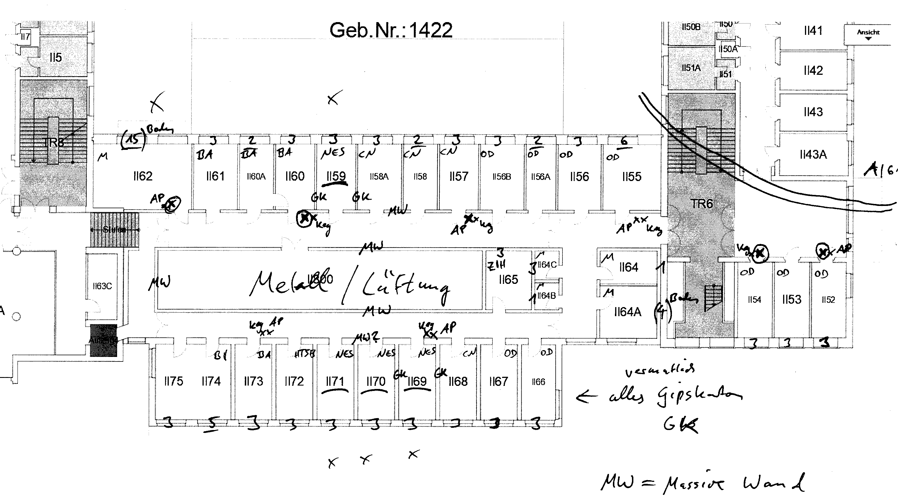
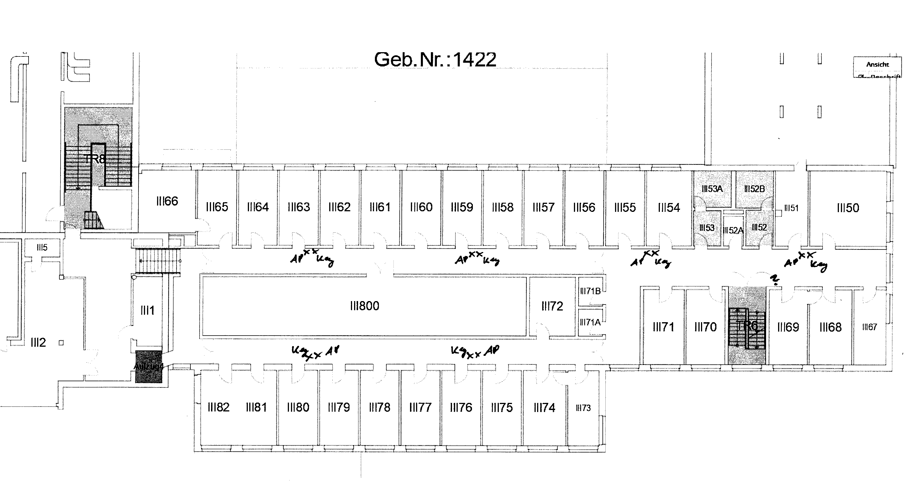

Concept - Testbed
-----------------

General Philosophy
    - only as complex as needed
    - most bang for the buck, not to expensive and to specialized design, hardware, etc
    - possibility to build on your own
    - unique selling point is the replay of energy (harvesting) sources and emulation of power converters with high temporal resolution

infrastructure
    - ~ 30 RF-Nodes (Beaglebone with custom RF-IC) with Ethernet-Backchannel
    - distributed on cfaed-floors, several rooms / offices, also on corridors
        - i.e. BAR II55 - II75, III50 - III80, II52 - II54, II40A-II43A (end in another dispatch-room)
        - we could use right side of ethernet-socket (largely unpatched for now)
        - Nodes should be secured by powerstrips (on the wall, under desk, ..)
    - RF stays within ETSI Norms, mainly bluetooth (Nordic nRF-Modules) or other IEEE 802.15.4 based standard
    - Nodes connected and powered via Ethernet-Backchannel, optional with PTP, QoS, POE-Support
        - preferred if Nodes are connected to one switch (in BAR II65) for low jitter for ~100 ns PTP timing-constraint
        - preferred if PoE could be controlled to shut down and reset nodes (mainly to safe energy)
    - **ZIH-Response and -Requirements**:
        - Nodes need installed fusion-inventory (to scan for vulnerabilities)
        - no QoS on Campus ("has more disadvantages")
        - POE -> Configuration-Access to Switch only when used exclusively for this vLAN
            - alternative: wake on LAN (WOL) -> no native beaglebone support (BBAI unclear, but unlikely)
        - current Switches should have very low jitter under low load, time in ASIC-Stack ~ 300 ns
            - lower latency ZIH alternative: infiniband, not applicable for us
        - we can't use the cable canal (== structural change)
        - wifi is used on channel 1, 6, 11, self managed with varying tx-power, often < 20 mW
        - nodes are allowed to use the 2.4 GHz Band without restrictions, ZIH also offers to disable Wifi on these channels either for one floor or based on a schedule (routers seem to have that option, but it is untested)
        - cisco switches offer "clean air"-Monitor-Service -> for II57 it reports 100% Quality with < 10 % non Wifi
        - ports on corridors can be used but ZIH-Infrastructure has higher priority
        - nodes may not get direct internet connection (relayed)

RF-Network-Design
    - limit to one floor
    - ring-structure (due to impenetrable II800) would be a nice novelty
    - the 3 consecutive NES-Rooms should be center of a cluster / group (something like 7 Offices with 3 Nodes each)
    - remaining network can be more sparse (1 in each office, or 1 every two)
    - there could be nodes with higher tx power and special antennas to directly link II59 and II71 (cut through II800)

Control-Server
    - one control-server that contains: user accounts, web interface, shepherd controller, measurement data
    - needs linux from debian-family, python 3.7+, ansible
    - 4 - 20 TB scratch area
    - Port 80 accessible from the internet
    - manageable from the intranet
    - needs access to vLAN of RF-Nodes (mostly ssh-based)
    - **ZIH-Requirements**:
        - managed by ZIH with Centreon
        - for access from internet the server needs a security-concept -> needs to pass Greenbone Security Manager Test (GSM-Test)
        - access via subdomain, cfaed, tu-website -> SSL-Certificate
        - no SSH from Internet

Data-Storage Constraints
    - 1 node, 1 min -> 54 MiB of measurement data
        - 7z compressable to 12 MiB (22%)
        - zip -> 23 MiB
        - tar -> 12 MiB
    - 1 Hour, 30 Nodes -> 100 GiB uncompressed

Misc
    - Casing in laser-acrylic or off-the-shelf case with custom front
        - input Marco: open and transparent is fine
        - Case should blend in, be passive and option to use powerstrips to attach it to wall or below desk
    - dynamic roles of nodes -> config can be "static" (network access, gps attached, mobile) -> ansible-roles
    - switching to BB-AI seems to be an important step, but price increase is 3.5 fold
        - focus is still on the PRUs, now 4 Cores
        - GBE is more than welcome
        - we get a more reliable power connection (type c instead of micro-usb)
        - CPU is hopefully drastically faster
            - BBB brings 995 BogoMIPS, 277 MIPS FP, 1600 MIPS Int (numbers from internet, see 25_improve_sw_linux.rst)
            - BBAI TBD
        - documentation and community is small, underdeveloped
    - with vCap in mind, PRU would be best replaced by a teensy 4.1 (keep it simple) or same uController
        - teensy has lots of iO, SPI with DMA & FIFO, FPU, 600 MHz, 1 MB RAM
    - web-interface should make clear that users are responsible to stay within ETSI-norm, no misuse, no out-of-boundary, monitoring and logging is active
    - ssh-interface should also make clear about project, active monitoring and offer a contact-email

Administrative Info
-------------------

- ZIH offers hosting of (self provided) physical server and virtual ones
    - ZIH Server-FAQ_
    - phyServer: gets power, ethernet, USV, cooling, ...
    - vServer: prefered by ZIH, free of charge, 3-5 Days prepare -> vServer-SelfService_
    - ZIH offers Sub-Domains on Website -> SubDomain-FAQ_
    - extended storage can be requested for research-groups: Gruppenlaufwerk_
- ZIH-Rules for using their infrastructure
    - central dhcp: only by IT-Admin of facility -> DHCP-FAQ_
    - network access: IT-Admin .. `FAQ <https://tu-dresden.de/zih/dienste/service-katalog/arbeitsumgebung/bereitstellung_datennetz>`_
    - cfaed IT-Admin_
    - WIFI interference und network capability undocumented online
- Answer to inquiry, from IT / ZIH
    - we could use right side of nw-sockets (currently mostly unpatched) -> TODO: talk with the leaders of groups that occupy offices
    - vLAN and DHCP from ZIH
    - we could use the server-room in BAR
    - ZIH offers more powerful vServers than listed on website
    - distribution plan shows that patch-cables of the floor all end in the same patch-room (BAR II65 S2/S3)
        - if switches do not meet our standards we can provide our own, needs to be a supported cisco model
        - if even that does not suffice it will get a lot harder -> bringing new cable / devices into the wall is a structural change with a whole book of needed permissions
    - if LAN-Sockets do not suffice, we can use a (cisco-)switch locally in offices
    - unix-nodes should host fusion-inventory (to scan for vulnerabilities)
    - hardware > 150 € needs to be in inventory (sticker & database listing)
    - vServer gets monitored / managed with Centreon
        - for access from outside (internet) the server needs a security-concept
    - passwords and access-data should be managed with "TeamPass" -> password manager for groups
- cfaed floor-plan_

.. _Server-FAQ: https://tu-dresden.de/zih/dienste/service-katalog/zusammenarbeiten-und-forschen/server_hosting
.. _DHCP-FAQ: https://tu-dresden.de/zih/dienste/service-katalog/arbeitsumgebung/zentrale_ip_adressverwaltung
.. _SubDomain-FAQ: https://tu-dresden.de/zih/dienste/service-katalog/arbeitsumgebung/domains-dns/management
.. _IT-Admin: https://cfaed.tu-dresden.de/it-support
.. _vServer-SelfService: https://selfservice.zih.tu-dresden.de/l/index.php/cloud_dienste
.. _floor-plan: https://navigator.tu-dresden.de/etplan/bar/02
.. _Gruppenlaufwerk: https://selfservice.zih.tu-dresden.de/l/index.php/spor/request-form/

RF-Measurement
--------------

- sender was a nRF52840-DK Board with BLE Beacon example, 1 MBit,
    - tx power - 16 to 8 dBm, in this case 0 and 8 dBm
    - rx sensitivity is - 97 dBm
- receiver was a phone, oneplus 3T, with visualisation of rx-power,
    - rx sensitivity down to - 100 dBm
    - path loss in direct proximity was about 50 dB
- measurement-mode: determine max range while using link-budget and keeping stable connection
- results for 0 dBm
    - range was about 4 offices (horizontal) with dry-wall in between
    - was not able to get to upper floor
    - no signal through II800
- results for 8 dBm
    - range is about 7 offices (horizontal) with dry-wall in between
    - packets reached upper floor, even the adjacent office next to the direct overlying one
    - no signal through II800, not even with direct wall contact (these are massive walls, with massive metal / ventilation parts inside
- with active use of II64 / II64B / II64C it would be possible to get a U-Shaped network
- see "10_rf_measurements.ods" for protocol

Anforderungen / Netzkonzept für das ZIH
-------------------------

- Projektbeschreibung
    - Prüfstand für Funknetzwerk-Algorithmen, speziell im Bereich Energy-Harvesting
    - Nachbildung verschiedener Funktopologien und Energie-Szenarien
- Start des Projekts
    - 01.02.2021 (falls ein direktes Datum benötigt wird)
    - es läuft bereits, daher so bald wie möglich
- Projektlaufzeit
    - drei Doktoranden benötigen das Projekt für ihre Forschung für 3-5 Jahre
- Gerätetypen, Menge, Kategorien
    - ~ 30 autonome Funkknoten mit Netzwerk-Backchannel, Basis sind Beaglebone Green, Einplatinenrechner mit Linux / Debian-Derivat
    - die ersten 10 Testknoten sind bereits einsatzfähig
    - die Linux-Knoten haben ihr eigenes vLAN und wurden gegen Zugriff abgesichert (keine offenen Ports, kein UART, starke PW)
    - Kategorisierung am ehesten als Laborgerät?
- Einsatzort
    - Verteilung der Knoten auf der unteren cfaed-Etage im Barkhausen Bau
    - mehrere Räume, BAR II52 - II75
    - einige Knoten auf den Fluren, Kopierraum, Postraum, Konferenzraum
    - Problem: durch den großen Lüftungsraum II800 wird das Funknetzwerk sehr fragmentiert, sodass ein Nutzen oben angesprochenen Räume wünschenswert ist
- Schutzbedarf
    - Geräte zeichnen nur Energieverläufe der Funkknoten und deren GPIO-Traces auf
    - keine sonstigen Sensoren werden ausgewertet
    - keine Nutzerbezogenen Daten
- Dienste, Zugriff
    - Koten befinden sich in eigenem vLAN,
    - Knoten bauen SSH-Verbindung (Port 22) zum virtuellen ZIH Kontroll-Server auf um Roh-Messdaten zu übertragen
    - PTP (Port 319/320) zur Synchronisierung der Knoten untereinander, t_delta <= 100 ns
    - Internet-Zugriff für die Knoten wäre wünschenswert (für Updates, bzw. für die Einrichtung)
- Funknetzwerk des Prüfstandes
    - RF Netzwerk befindet sich im 2.4 GHz ISM-Band, bleibt innerhalb der ETSI-Norm, hauptsächlich IEEE 802.15.4, beispiel Bluetooth
    - Bluetooth belegt 81x 1 MHz breite Kanäle von 2400 - 2480 MHz und benutzt Frequency-Hopping, d.h jedes Paket wird auf einem anderen Kanal gesendet, mehrere tausend Sprünge pro Sekunde
- Besondere Anforderungen
    - Ethernet-Rückkanal der Knoten braucht Unterstützung für GBE, PoE, wenn möglich PTP nativ im Switch
    - im Bestfall wäre PoE abschaltbar (vom Kontrollserver) um das Netzwerk auszuschalten (Energiesparen), oder einzelne Knoten neuzustarten
    - PTP-Anforderung: Synchronisationsabweichung << 1 us zwischen den Knoten, optimal wären 10-100 ns
- wir sind offen für alle administrativen bzw. Sicherheits-Auflagen die notwendig sind zur Erfüllung der Anforderungen

Gesprächsprotokoll mit dem Treffen von Herrn Fleck
------------------------------------

- unsere Anforderungen wurden kommuniziert und angenommen, Punkte die mehr diskutiert wurden sind hier angeführt
- Cisco-Wifi-Router
    - das ZIH hat ein temporäres (sowie dauerhaftes) Abschalten von WLAN im 2.4 GHz Band auf der Etage angeboten
    - wir würden das Angebot gerne Annehmen, aktuell halten wir beispielsweise ein regelmäßiges Scheduling für Samstag / Sonntag ab sinnvollsten
    - betroffene sechs Router (+NW-Dose)
        - BAR-AP-A-II52 (II65_S2_K_21)
        - BAR-AP-A-II56 (II65_S2_K_13)
        - BAR-AP-A-II57 (II65_S2_J_7)
        - BAR-AP-A-II62 (II65_S2_H_13)
        - BAR-AP-A-II69 (II65_S3_B_15)
        - BAR-AP-A-II73 (II65_S3_C_17)
- zu beschaltene NW-Dosen
    - Laut Aussage vom ZIH dürften wir (mit niedrigster Priorität) ebenfalls NW-Dosen auf den Fluren bzw. öffentlich genutzen Räumen benutzen
    - siehe Liste unter https://github.com/orgua/shepherd_v2_planning/blob/master/10_cfaed_ethernet_ports.ods
    - Dosen bleiben weiterhin normal benutzbar, da vLAN per MAC-Filter funktioniert
- Kontrolle über POE
    - laut ZIH denkbar, wenn ein dedizierter Switch für den Prüfstand zum Einsatz kommt
- PTP-Zeitsynchronisation
    - laut ZIH optimal, wenn ein dedizierter Switch für den Prüfstand zum Einsatz käme
    - Jitter der Switches unter geringer Last angeblich sehr gering, im Datenblatt spezifiziert

Weitere Entwicklung zur Infrastruktur, 2021-01-29
------------------------------------

- Switch vom ZIH gestellt und gemanaged - WS-C2960X-48FPD-L
- 10 GBit Uplink zum Server, wenn Port frei ist (ist er)
- Nur NES-Lab-Netz auf den gewünschten Dosen
- Switch erlaubt POE mit insgesamt 740 W, also 40 Geräte a 15 Watt sind abgedeckt, BB brauchen ~3 W
- POE nicht dynamisch vom Server schaltbar, sondern nur händisch von IT
- PTP nicht nativ vom Switch unterstützt, aber der ist später austauschbar (Eigenleistung von uns)
- Dosen im öffentlichen Raum weiterhin generell ok, aber explizit untergeordnet und erst nach Begehung mit OK vom ZIH

- 10 TB Gruppenlaufwerk
    - self-service, funktionslogin
    - dom.ts.[].zih.... - account hinzufügen, admins volle Rechte, mehr Gruppenmitglieder hinzufügen
    - zugangsdaten im tu-passwortspeicher ablegen
    - einbinden über fstab als smb-lw, spezielle root-rechte
- Server Roadmap
    - mit fake ssl zum laufen bekommen
    - self service -> sicherheits-prüfung kontinierlich durchgeführt
    - subdomain shepherd.cfaed. ... beantragen
    - ssl-zertifikat anfordern (anleitung ZIH) -> kein pW-Schutz beim private Key, sonst ist bei jedem boot ein PW erforderlich
- Webseite
    - Barrierefreiheit und Impressum, sonst keine Weltweite freigabe (und ssl-force, subdomain)

Anforderungen

- vLan
    - Zugriff vom Kontroll-Server aus, SSH (TCP Port 22)
    - Internet-Zugriff der Knoten für Linux-Updates
    - maximale Größe 45 Geräte
    - Campusgeroutet, ...
    - autorisierte MAC-Adressen landen automatisch im vLAN
    - TODO: MAC-Adress-Liste
- vServer als Kontroll- und Web-Interface
    - (die engen Zeitsynchronisierungsvorgaben gelten hier nicht)
    - Software die benötigt wird: Debian Linux Derivat, python 3.7+, ansible
    - >>100 GB scratch-area
    - Port 80 erreichbar aus dem Internet für Web-Interface, im Bestfall mit Sub-Domain oder eingebettet in CFAED-Seite
    - Personenbezogene Daten: später werden für die User-Accounts eventuell Email-Adressen gespeichert, eventuell umgehbar mit OAuth
- Cisco-Wifi-Router
    - das ZIH hat ein temporäres Abschalten von WLAN im 2.4 GHz Band angeboten
    - wir würden das Angebot gerne Annehmen, aktuell halten wir beispielsweise ein regelmäßiges Scheduling für Samstag / Sonntag ab sinnvollsten
    - betroffene sechs Router (+NW-Dose)
        - BAR-AP-A-II52 (II65_S2_K_21)
        - BAR-AP-A-II56 (II65_S2_K_13)
        - BAR-AP-A-II57 (II65_S2_J_7)
        - BAR-AP-A-II62 (II65_S2_H_13)
        - BAR-AP-A-II69 (II65_S3_B_15)
        - BAR-AP-A-II73 (II65_S3_C_17)
- zu beschaltene NW-Dosen
    - Laut Aussage vom ZIH dürften wir (mit niedrigster Priorität) ebenfalls NW-Dosen auf den Fluren benutzen
    - siehe Liste unter https://github.com/orgua/shepherd_v2_planning/blob/master/10_cfaed_ethernet_ports.ods
    - Dosen bleiben weiterhin normal benutzbar, da vLAN per MAC-Filter funktioniert
- NW-Switch in Raum II65
    - GBE (maximal benötigte Geschwindigkeit)
    - optimal ist ein dediziertes Gerät mit >= 40 Ports -> Ziel: sehr geringer Jitter bei PTP-Zeitsynchronisierung der Knoten
    - vLan-Zugriff für Knoten
    - wenn möglich Kontrolle über POE der Ports zum Energiesparen, da embedded Knoten zwar runtergefahren werden können, aber kein WOL beherrschen

Anbringung der Knoten
---------------------

- controlled by: https://tu-dresden.de/tu-dresden/organisation/zentrale-universitaetsverwaltung/dezernat-4-gebaeudemanagement/sg-4-1-baumanagement/bautechnik
- formular:  https://www.verw.tu-dresden.de/VerwRicht/Formulare/download.asp?file=Baubedarfsblatt.pdf

- die Projektlaufzeit beträgt etwa 3-5 Jahre
- die 30 Testknoten benötigen als Verbindung lediglich jeweils ein LAN-Kabel
- Das Gehäuse kann entweder flach oder würfelförmig werden, das benötigte Volumen beträgt etwa 0.5 Liter
- Das enthaltene System verbraucht etwa 3-5 W bei Aktivität (5V), bedeutet also keine signifikante Wärmequelle
- wir beschränken uns auf die cfaed-Etage mit den Räumen BAR II52 - II75
- in der Auswahl sind hauptsächlich Büros, Kaffeeküche, Postraum, ein Konferenzraum und einige Flur-Positionen
- wir haben das OK von den Lehrstühlen, bzw. der Bürobesetzung und vom ZIH
- das ZIH hat bereits ein Subnetz für uns geschaltet

Anforderungen zur Anbringung
----------------------------

- Genehmigung der Bundesnetzagentur (Funk)
    - wir operieren im ISM-Band und halten uns an die geltenen Bestimmungen, bzw. nutzen wir OEM / off-the-shelf-Funk-Module, zertifiziert
- Einzeichnung Standorte in Grundrisse
    - Standorte müssen noch ermitteln werden
- Zustimmung der aktuellen Nutzer ist schriftlich vom Kostenstellenverantwortlichen zu zeichnen
- Standorte im Flur und der Küche -> separater Antrag an das Sachgebiet 4.3
- ggf. Brandschutzbewertung notwendig -> Kostenstelle in Höhe ca. 1-1,5 TEuro benötigt
    - Formular von Herrn Heyner
- formloses Betreiberkonzept
- Gefährdungsbeurteilung ist mit der Arbeitssicherheit SG 4.5 abzustimmen

Plan zur Anbringung
-------------------
- Gehäuse
    - Elektronik nicht anfassbar, aber Belüftung möglich
    - keine leicht entflammbaren Materialien
- Betreiberkonzept Vorentwurf
- mit SG 4.3 in Verbindung setzen
- mit SG 4.5 in Verbindung setzen

Comparison D-Cube
-----------------

- D-Cube-Overview_
- DBs: relational -> MariaDB, Time Series -> InfluxDB
- user interface -> Grafana
- gpio-tracing -> isolators for usb, power, bi-dir gpio (TI ISO7220M, ISO7221M, ADUM3160, NXE2)
- latency profiling -> Navspark-GL, later uBlox Neo
- power profiling -> TI LMP92064
- interference generator -> JamLab-NG
- supports binary patching
- PoE via PEM1305

.. _D-Cube-Overview: http://www.carloalbertoboano.com/documents/D-Cube_overview.pdf

Comparison Flocklab
-------------------

- 3 Targets
- Target-GPIO with resolution of 100 ns with accuracy +- 200 ns

Inventory
---------

- ~20 PoE Adapters (100 MBit)
- 10 - 15 Beaglebone Black / green, same amount of Shepherd V1.x Capes
- ZyXEL Ethernet Switch GS1900-24HP, with PoE
- Linksys Router WRT54GL
- uBlox Neo M8T

Order List
----------

ordered 2020-11
    - 30x BBG, 47 € -> 1410 € (w/o tax)
    - 40x NW Cable, 0.5 / 1.0 / 1.5 / 2.0 m, 10 of each, 2-4 € -> 31 + 37 + 19 + 47 = 134 € (w/o tax)
    - different 128 GB USB-Sticks (Samsung, Kingston, Philips), from Expensive to Cheap, -> 15 + 17 + 21 = 53 €
    - 2x Compact mountable POE-Splitters, 11 - 20 € -> 31 €
    - Solder Paste, 23 €

ordered 2020-12
    - 3-5 uSD-Cards for fast flashing Firmware, min 8 GB, 30 MB/s RW,
        - https://geizhals.de/?cat=sm_sdhc&xf=15024_microSD%7E2455_30%7E2456_30%7E307_8%7E8281_128&sort=p#productlist
    - nRF-Target, preferred with 32.768 Hz crystal
        - dongle-kit nRF52840 -> must be modded on back for low voltage, https://www.digikey.de/product-detail/de/nordic-semiconductor-asa/NRF52840-DONGLE/1490-1073-ND/9491124
        - ublox bmd-340, already with crystal https://www.mouser.de/ProductDetail/u-blox/BMD-340-A-R?qs=%2Fha2pyFaduh5puKd80a2%252BxNay0XTXM1gZjYgTBrwSh3foS6gIJUSvg%3D%3D
        - panasonic enw-8985, already with 32k Crystal, https://www.mouser.de/ProductDetail/Panasonic/ENW-89854A1KF?qs=B6kkDfuK7%2FD%2F8POzJ9tJcg==
        - panasonic included in BOM
    - some BB-Crystals: https://www.mouser.de/ProductDetail/Citizen-FineDevice/CM200C32768HZFT?qs=rkhjVJ6%2F3ELrGt3qchcVtQ%3D%3D
    - 256 GB USB-Sticks, min 40 MB/s writing
        - https://geizhals.de/?cat=sm_usb&xf=2938_262144%7E309_262144%7E476_40

order 2020-12B
    - 30x Tl-POE10R
    - short NW-Cables <= 10cm

dismissed
    - Beaglebone AI, 110 €
        - 93 € / 107 €, https://de.rs-online.com/web/p/entwicklungstools-prozessor/1901825/?relevancy-data=7365617263685F636173636164655F6F726465723D31267365617263685F696E746572666163655F6E616D653D4931384E53656172636847656E65726963267365617263685F6C616E67756167655F757365643D6465267365617263685F6D617463685F6D6F64653D6D61746368616C6C7061727469616C267365617263685F7061747465726E5F6D6174636865643D5E2E2A24267365617263685F7061747465726E5F6F726465723D313333267365617263685F73745F6E6F726D616C697365643D59267365617263685F726573706F6E73655F616374696F6E3D267365617263685F747970653D43415443485F414C4C5F44454641554C54267365617263685F7370656C6C5F636F72726563745F6170706C6965643D59267365617263685F77696C645F63617264696E675F6D6F64653D4E4F4E45267365617263685F6B6579776F72643D626561676C65626F6E65206169267365617263685F6B6579776F72645F6170703D626561676C65626F6E65206169267365617263685F636F6E6669673D3026&searchHistory=%7B%22enabled%22%3Atrue%7D
        - 107 €, https://www.arrow.de/products/bbone-ai/beagleboardorg?utm_currency=EUR
        - 115 €, https://eu.mouser.com/ProductDetail/BeagleBoard/BBONE-AI?qs=%252B6g0mu59x7IfEw1Zb81%252B%252BQ%3D%3D
        - the cheaper BBG without HDMI and WIFI came 3 years after BBB, so we don't have to wait for cheaper BBAI
    - >=Cat5e Cables white, 10 €, https://geizhals.de/?cat=kabelnw&xf=2374_0.25%7E2375_wei%DF%7E8252_1

TODO
    - GPS-Module with external Antenna, uBlox LEA-M8F or ZED-F9T
    - final GBE PoE Adapter, 20 €
        - https://geizhals.de/?cat=switchgi&xf=12885_PoE-Splitter
        - Possible Copy of POE-Splitter RPi-Hat https://www.raspberrypi.org/forums/viewtopic.php?t=266617
    - Shepherd Cape, 15 €
    - Shepherd Parts
    - Target Capelet
    - Target Parts
    - Casing
    - NAS or Server
        - ~ 250 € per 10 TB
        - 300 € for 4 Bay NAS, 800 € for 8 Bays
        - https://geizhals.de/?cat=hdxnas&xf=12970_8%7E2659_ohne
    - [48 Port Managed Cisco NW Switch]
