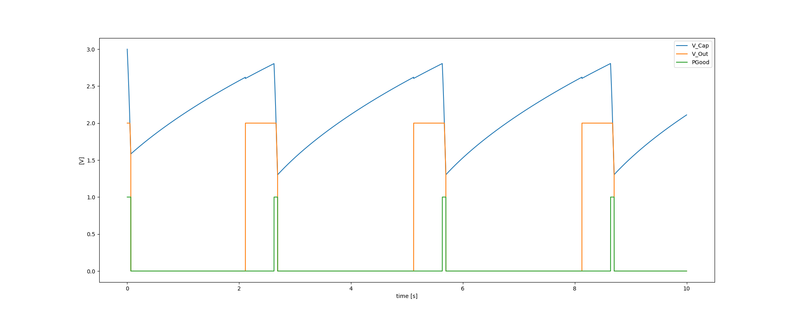

Virtual Source
==============

Current Features
----------------

- capacitor, with
    - max voltage
    - leakage current
    - power-good-signal with hysteresis
    - status check interval
- Boostconverter, with
    - enable threshold voltage
    - efficiency factor
- buck converter, optional, with
    - fixed output voltage
    - efficiency factor
- switchable output
    - simulated external Capacitor - should be set to buffer size of target: fast transients can't be monitored by shepherd
    - enable threshold voltage hysteresis

Implementation
--------------

- fixed point math with u32 & u64 with voltages in uV, currents in nA, power in fW, capacity in nF
- a python port is available
- modules
    - InputPower - calculated from recorded C-V-traces
    - OutputPower - voltage is set by DAC, current is measured by ADC
    - CapacitorUpdate - Voltage delta is calculated by resulting sum of Power
    - regulatorUpdate - handles internal States and Output
- limits
    - input power can be 56 bit in size (fW = uV * nA) -> ~ 72 W
        - lowest value for algorithm is 64 fW, but due to ADC limitations 195 nA * 19 uV = 3.7 pW
    - output power can be 50 bit in size (fW = uV * nA) -> ~ 1 W
        - difference to input due to inverted efficiency taking 14 instead of 8 bit
    - capacitor voltage can be 4.2 kV
        - due to custom faster division-function the range with low error is 0 to 5 V
        - optimization in calc_out_power limits voltage to 2^28 uV = 268 V, lower bound is 64 uV
    - storage capacitor can not be larger than 2.68 F (= 10*(2^28) nF)
    -
- Speed in PRU (max timings)
    -   280 ns calc input power
    -  3200 ns calc output power
    - 10500 ns update capacitor
    -   470 ns update boost-buck
    - ~14000 ns for all (with space in between)
- Optimizing Algorithm for Speed
    - a custom uDiv() brings "update cap" down to 7500 ns, whole iteration takes 11684 ns
    - leaving out I_leakage is significantly faster (calc output is done in 310 ns instead of 3200, similar to input) but resulting output-power is wrong
        - seems to be undefined behaviour introduced by implicit typecasting
        - -> undefined it is! see documentation below
    - new ruleset:
        - u64 add, sub, shift are fine and fast!
        - u64 mul should be avoided, duration is depending on size of number (3000 - 4800 - 6400 ns for 4, 16, 32 bit)
        - u32 * u32 can give u64 result when both or last factor are typecasted - it is still fast! -> uint64_t result = (uint64_t)num32a * (uint64_t)num32b;
- using the ruleset brings:
    -  280 ns calc input power
    -  430 ns calc output power
    - 5400 ns update capacitor
    -  540 ns update boost-buck
    - resulting time is around 6900 - 7060 ns
- using a custom mul64()-function
    -  280 ns calc input power
    -  500 ns calc output power
    -  950 ns update capacitor
    -  540 ns update boost-buck
    - resulting in < 2600 ns for all

TI Compiler behaviour::

    u64 * u64 -> 7 us
    u32 * u64 -> 2.56 us
    u64 * u32 -> 0.03 us, es rechnet nur u32*u32

    uint64_t debug_math_fns(const uint32_t factor, const uint32_t mode)
    {
        const uint64_t f2 = factor + ((uint64_t)(factor) << 32);
        const uint64_t f3 = factor - 10;
        GPIO_TOGGLE(DEBUG_PIN1_MASK);
        uint64_t result = 0;
        if (mode == 1)
        {
            const uint32_t r32 = factor * factor;
            result = r32;
        }									// ~ 28 ns, limits 0..65535
        else if (mode == 2)	result = factor * factor; 			// ~ 34 ns, limits 0..65535
        else if (mode == 3)	result = (uint64_t)factor * factor; 		// ~ 42 ns, limits 0..65535 -> wrong behaviour!!!
        else if (mode == 4)	result = factor * (uint64_t)factor; 		// ~ 48 ns, limits 0..(2^32-1) -> works fine?
        else if (mode == 5)	result = (uint64_t)factor * (uint64_t)factor; 	// ~ 54 ns, limits 0..(2^32-1)
        else if (mode == 5)	result = ((uint64_t)factor)*((uint64_t)factor); // ~ 54 ns, limits 0..(2^32-1)
        else if (mode == 11)	result = factor * f2;				// ~ 3000 - 4800 - 6400 ns, limits 0..(2^32-1) -> time depends on size (4, 16, 32 bit)
        else if (mode == 12)	result = f2 * factor;				// same as above
        else if (mode == 13)	result = f2*f2;					// same as above
        else if (mode == 21)	result = factor + f2;				// ~ 84 ns, limits 0..(2^31-1) or (2^63-1)
        else if (mode == 22)	result = f2 + factor;				// ~ 90 ns, limits 0..(2^31-1) or (2^63-1)
        else if (mode == 23)	result = f2 + f3;				// ~ 92 ns, limits 0..(2^31-1) or (2^63-1)
        else if (mode == 24)	result = f2 + 1111ull;				// ~ 102 ns, overflow at 2^32
        else if (mode == 25)	result = 1111ull + f2;				// ~ 110 ns, overflow at 2^32
        else if (mode == 26)	result = f2 + (uint64_t)1111u;			//
        else if (mode == 31)	result = factor - f3;				// ~ 100 ns, limits 0..(2^32-1)
        else if (mode == 32)	result = f2 - factor;				// ~ 104 ns, limits 0..(2^64-1)
        else if (mode == 33)	result = f2 - f3;				// same
        else if (mode == 41)	result = ((uint64_t)(factor) << 32u);		// ~ 128 ns, limit (2^32-1)
        else if (mode == 42)	result = (f2 >> 32u);				// ~ 128 ns, also works
        GPIO_TOGGLE(DEBUG_PIN1_MASK);
        return result;
    }

