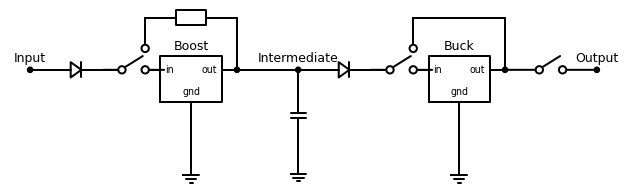
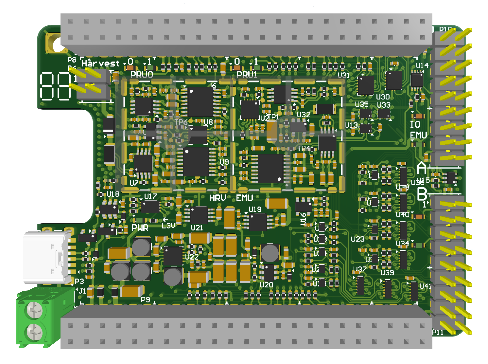
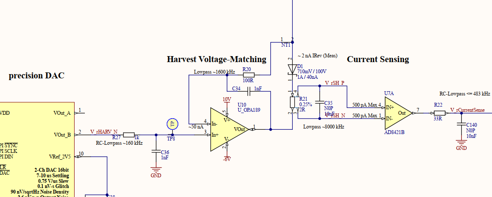
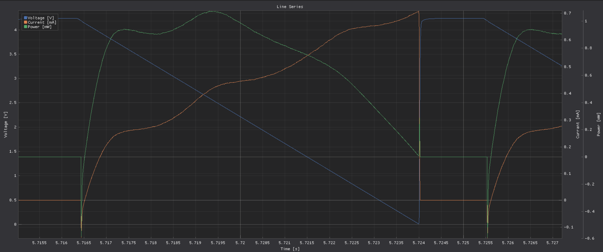
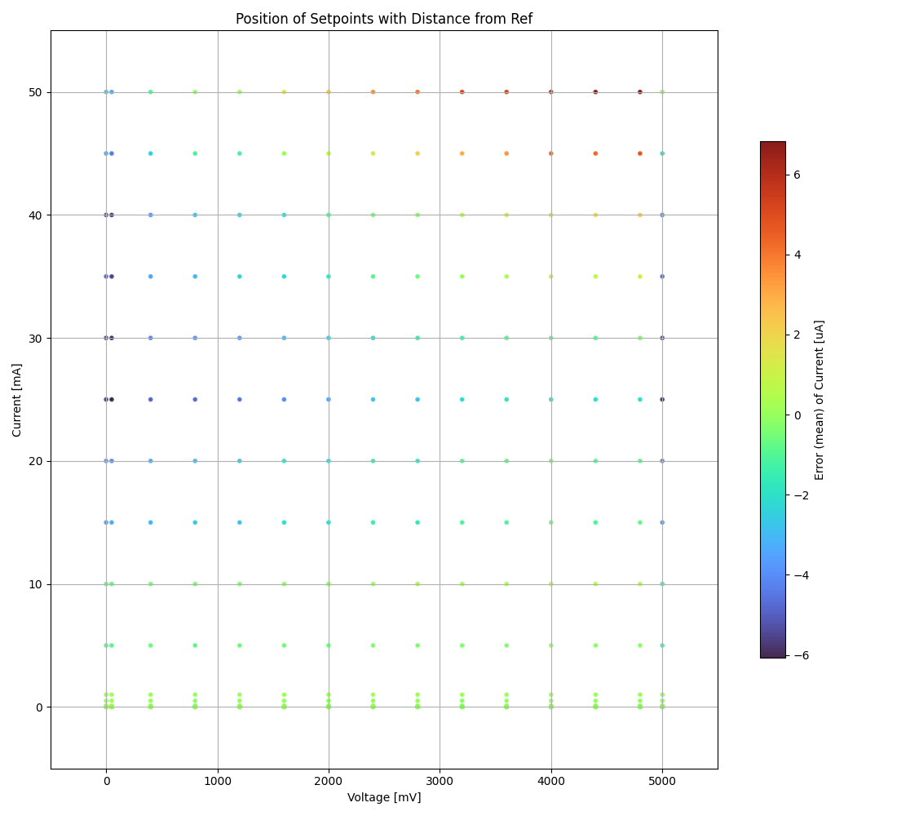
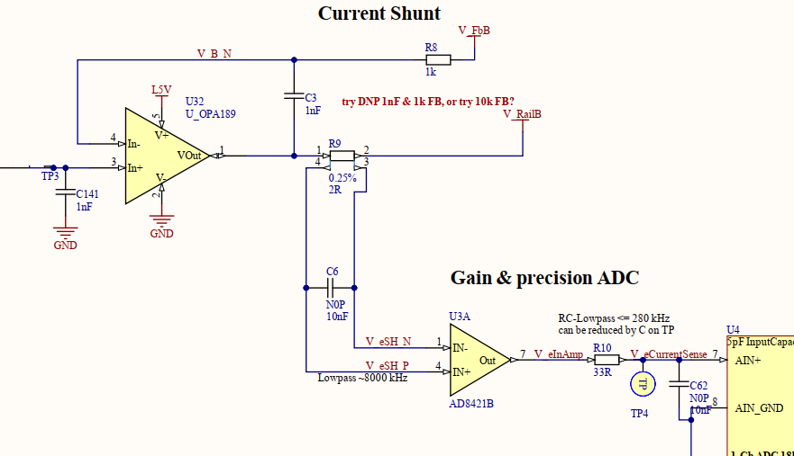
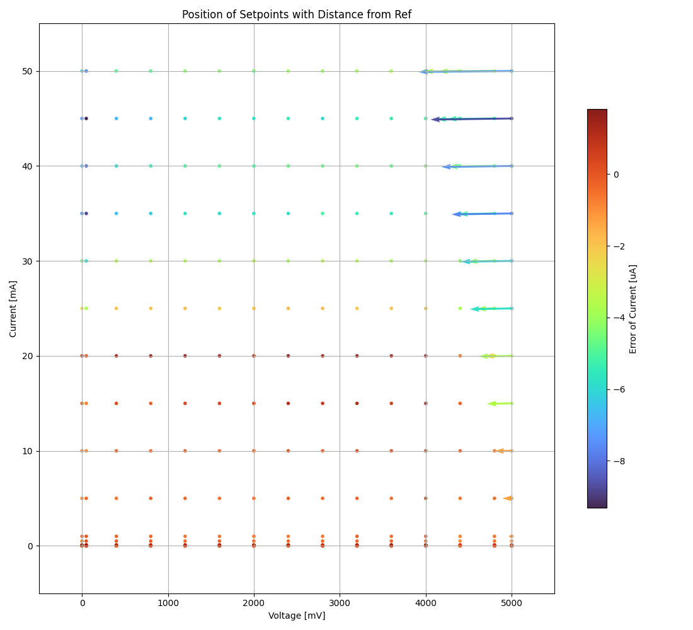
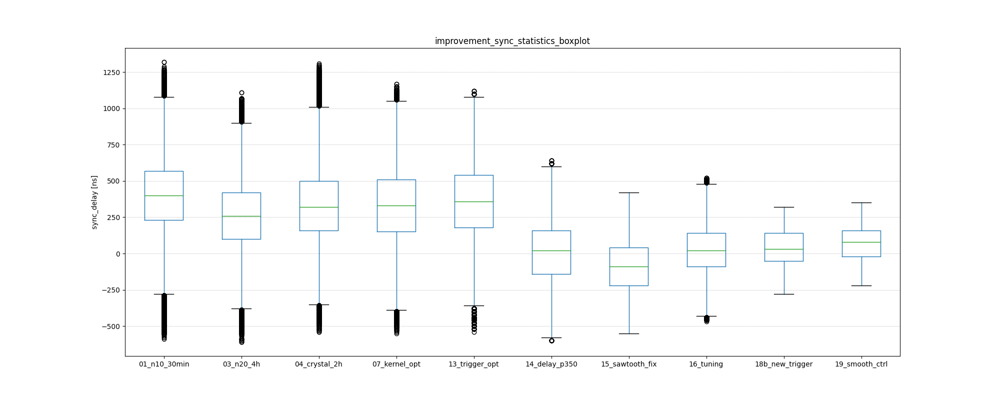
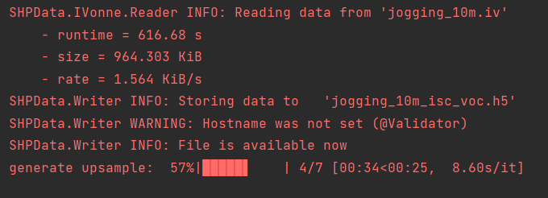
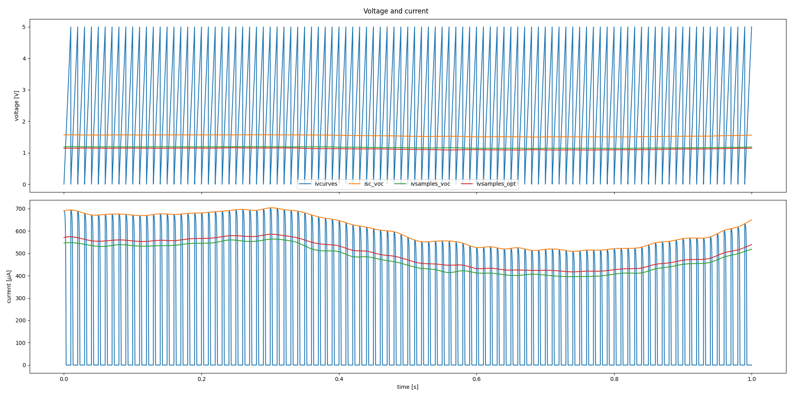

Improvements of Shepherd V2
----------------------------

**About Shepherd v1.x (from git)**

Shepherd is a testbed for the batteryless Internet of Things, allowing to record harvesting conditions at multiple points in space over time. The recorded data can be replayed to attached wireless sensor nodes, examining their behaviour under the constraints of spatio-temporal energy availability.

**About Shepherd v2.x**

Previous description is still correct, in detail:

- embedded linux board with analog frontend serves as a shepherd node
- harvesting-circuit can record an energy trace from a energy-source like solar, thermoelectric, ...
- emulation-circuit replays the energy-trace for a real target (user programmable uController) and records the drawn energy

**Version 1** is build around a BQ25504-IC (plus capacitor) as harvester for recording and emulating various environments. This is a valid approach, but limited by design:

- BQ-MPPT-controller is slow to react on changing environmental conditions by design (check every 16s with 64 ms downtime)
- (VOC-)mppt-controller is fairly simple with pre-set setpoint (e.g. 76 % of open-circuit voltage for solar cells)
- recorded harvest-environment is specific to harvest-IC + configuration
- setup / configuration (especially) with storage cap is fairly static (combination of MPPT-Controller, Boost-Converter, Cap)

**Version 2** improves the project by generalizing the basic idea and therefore virtualizing the harvester, storage capacitors and voltage converters. By switching to a software defined / virtual harvester-system and power-source the disadvantages from v1 vanish, with further advantages

TODO: add Overview-Schematic

- full customization per config-parameters (e.g. boost-voltage, capacitor size, ...)

    - currently 10 parameters for the harvester, and
    - 29 parameters for the converter-stage

- harvesting-recorder has already several strategies implemented

    - constant voltage (CV)
    - MPPT, based on open circuit voltage or perturbe & observe

- harvesting can also be postponed by sampling

    - iv-curves from the energy-source
    - model-parameters like voc and isc for solar (higher rate than iv-curves)

- emulation handles harvested energy-traces or harvests directly from the iv-curves and simulates a customizable converter-stage
- power-stage has already predefined templates for several setups

    - direct throughput of traces
    - diode + capacitor (converterless)
    - buck-boost-converter (e.g. BQ25570) including the power-good-signal and efficiencies of underlying converters
    - buck-converter (BQ25504)

- the design enables users to automate testing of harvesting-setups e.g. by sweeping through parameters like storage-cap-size
- the emulator and harvester are consisting of a purpose-fully chosen combination of low-noise and high-speed DACs, ADCs and Instrumentation-Amplifiers

    - both circuits can handle 0 - 4.2 V (hrv even 5.0V) with up to 50 mA current
    - resulting resolution 18 bit, step size is ~ 200 nA and 20 uV for voltage and current

- the software-implementation updates in real time with 100 kHz

**General improvements for shepherd beside the virtualization**

- synchronization of sampling-trigger for node network optimized from ~ 2.4 us to under 500 ns
- jitter of sampling trigger improved from about +- 600 ns to under 100 ns
- two target-ports available, selectable via setup-parameter
- two parallel power rails available for the targets (one with current measurement, switchable)
- one default target with a nrf52-module
- 9 GPIO-Channels between target and system (pru-monitored)

    - partly bidirectional, switchable
    - relatively stable 4.03 MHz, min: 602 kHz, max: 4.55 MHz
    - previously ~ 160 - 1500 kHz, with 6 GPIO

- watchdog to handle hangups during unsupervised operation (and wakeups for saving power)
- screw-in power-socket or type-c connector

**Currently in development**

- software programmer (in pru) for SWD & SpyBiWire
- advanced target with msp430 (with FRAM) and nrf52 for various configurations: only 1 uC active, msp as processor and nrf as radio, nrf as processor+radio and msp as low-energie storage
- combined network of shepherd nodes as iot-testbed with web-based control
- update doc
- advanced PRU-Firmware without virtual harvester & source, but higher min rate for gpio-sampling (goal: > 5 MHz)
- GPIO-Actuation

**Bigger challenges in near future**

- hardware is getting quite old, but luckily software is improving (getting faster)
- kernel 4.19 currently works (but has flaws) -> latest updates to 5.10 break kernel-module & pru
- chip-shortage is limiting our supply - 2 ICs only 15 left, current restock date mid '23

Details
=======

- disclaimer: graphs and stats are partly outdated
- scraped from the planning-git

Hardware
________

- the emulator and harvester are consisting of a purpose-fully chosen combination of low-noise and high-speed DACs, ADCs and Instrumentation-Amplifiers
    - both circuits can handle 0 - 5 V with up to 50 mA current
    - LSB is ~ 200 nA and ~ 20 uV for voltage and current

- two target-ports available, emulator / user can choose
- two parallel power rails available for the targets (one with current measurement, switchable)
- one default target with a nrf52-module
- 9 GPIO-Channels between target and system (pru-monitored), switchable
- watchdog to handle hangups during unsupervised operation
- screw-in power-socket or type-c connector

**Shepherd Cape v2.3**

- 360 components, 55 unique - > tedious, but ok to hand-solder

.. image:: media_recap/pcb_picture_shepherd_cape_soldered.jpg

**Shepherd Cape v2.4**

- chip shortage forced us to a ultra fine pitch (350 um) -  risky and hard to hand-solder
- switch to 6 layer due to higher gpio-count
- 1 Free Pin left on BBone

**nRF52-Target v2.3**

- soon new Target with MSP430 (FRAM) & nRF52 on one PCB

.. image:: media_recap/pcb_picture_nRF_Target_reflowed.jpg

Harvester Circuit
_________________

Schematic

Diode selection

- datasheets only promise < 40 nA

.. image:: media_recap/diode_reverse_currents_smu-measured.png

Fine tuning Filters

.. image:: media_recap/hrv_iv110Hz_A5V_0mF.png

Resulting Performance

Virtual Harvester
-----------------

- either harvest right away (MPPT, constant voltage) -> iv-stream
- or defer the harvesting by sampling ivcurves (or isc & voc)
- configurable by 10 parameters

.. table:: Implemented harvest-algorithms (& parameters)

    =============   ===================================================
    Algorithm       Parameters
    =============   ===================================================
    ivcurve         window size, v_min, v_max, wait-cycles, direction
    isc & voc       wait-cycles
    v-const         voltage
    mppt-voc        setpoint, t_interval & t_duration (voc-measurement)
    mppt-po         v_min, v_max, v_step, t_interval
    =============   ===================================================

Emulator Circuit
----------------

- lowest resolution, set by software / resistor
    - DAC 19.53 uV
    - ADC 190 nA
    - voltage set in < 8 us
- switches and traces get compensated on PCB (Feedback is coming from target-header pin)

Performance

- at 50 mA around 3.8 V are usable without large error

Virtual Source
-----------------

General  Features

- integrated into PRU, calculated and updated at 100 kHz
- fully customizable per yaml-parameter-set (29+ parameters)

    - predefined sets by name ie. "virtsource: BQ25504s" for the BQ-Regulator with additional schmitt-trigger for pwr-good
    - neutral parameter-set is base -> direct throughput
    - inherit from existing parameter-sets -> only add altered parameters in new set

- emulator can either record output or intermediate voltage (storage cap)
- naming: source = harvester + converter
- design enables users to automate testing of harvesting-setup e.g. by sweeping through parameters like storage-cap-size

Examples for predefined parameter-sets

- direct throughput of traces
- simple diode + capacitor
- buck-boost-converter (e.g. BQ25570) including the power-good-signal and efficiencies of underlying converters
- buck-converter (BQ25504)

Input

- oneway, imagine a perfect diode at the start so no current can flow back
- diode voltage-drop can be configured from 0 to x Volt
- maxima for input voltage and current (power limit)

Boost-Converter, optional

- enable minimum threshold voltage for input
- disable maximum threshold for boost-output (intermediate voltage)
- efficiency factor with 2D-LUT (12x12),
    - depending on input voltage & current
    - thresholds are configurable in 2^n steps
    - voltage divisions are linear, depending on lowest threshold
    - current-divisions are log2, also depending on lowest threshold
    - example: voltage threshold n=7 is setting first array boundary to 2^7 = 128 uV, so lut[0] is for V < 128 uV, lut[1] is for 128 to 256 uV

Capacitor, optional

- capacitance from 1 nF to 1 F
- initial voltage
- leakage current
- switchable output, hysteresis with checks at defined intervals
- power-good-signal with hysteresis either in intervals or immediate (schmitt-trigger)

Buck-Converter, optional

- fixed output voltage
- ldo-drop-voltage, alternatively working like a diode when buck is off or intermediate voltage is below output-voltage + drop-voltage
- efficiency factor with 1D-LUT
    - depending on output-current
    - threshold is configurable in 2^n-steps
    - current-divisions are log2, depending on lowest threshold
    - example: current threshold n=5 is setting first array boundary to 2^5 = 32 nA, so lut[0] is for I < 32 nA, lut[1] is for [32, 64] nA, lut[2] is for [64, 128] nA

Switchable output

- simulated external Capacitor - should be set to buffer size of target: fast transients can't be fully monitored by shepherd

Pins to Target
--------------

.. table:: GPIO Implementation

    ==========  =========   =========   =========   =========
    Pin-Name    2nd FN      Ctrl        Dir         Pru-Mon
    ==========  =========   =========   =========   =========
    GPIO 0                  dir1-pin    Rx-Tx       yes
    GPIO 2                  dir1-pin    Rx-Tx       yes
    GPIO 3                  dir1-pin    Rx-Tx       yes
    GPIO 1                  dir1-pin    Rx-Tx       yes
    GPIO 4                              always RX   yes
    GPIO 5                              always RX   yes
    GPIO 6                              always RX   yes
    GPIO 7      uart rx                 always RX   yes
    GPIO 8      uart tx     dir2-pin    Rx-Tx       yes
    BAT OK                              always TX   (yes)
    SWD1 CLK    jtag TCK                always TX
    SWD1 IO     jtag TDI    pDir1-pin   Rx-Tx
    SWD2 CLK    jtag TDO                always TX
    SWD2 IO     jtag TMS    pDir2-pin   Rx-Tx
    ==========  =========   =========   =========   =========

Sampling frequency of gpio-monitor

- legacy	   -> 160 kHz ... up to 1.5 ... 2.9 MHz
- intermediate -> relatively stable 4.03 MHz, min: 602 kHz, max: 4.55 MHz
- current code ... tbd

Electrical side

- translator: 74LVC2T45GS
- 470 R line resistor and 100k PU on both sides
- analog switch: PI5A4158, ~ 34 pF line-capacitance, [< 20 nA leakage]
- previous switch: > 300 pF, < 1 nA leakage

Performance-data

- not available atm
- previous switch limited to ~ 200 kHz
- capacitance on line is ~ 1/10, resistance ~ 1/2 -> 2 MHz should be fine

Logging of system parameters while recording

- io calls
- cpu usage
- nw usage
- ram usage

Timesync
--------

- shepherd V1 started with +- 2.4 us error
- improvements on PRU-Level helped to push the boundaries
- also important: hardware-accelerated network-switch
- tbd: cisco-switch in TUD has layer 3 routing and >doubled spec -> could improve sync

Error between nodes

- q95% is < +- 200 ns

Jitter between Trigger-Events (local)

- q95% is around +- 50 ns (10 pru cycles)

.. image:: media_recap/sync_improvement_trigger_statistics_boxplot.png

Datalib
-------

- API for py and cli
- read, write (and generate) shepherd-files
- check for plausibility and validity
- extract data and metadata, convert, downsample, plot, repair

multiplot for ivcurve, isc / voc, voc-harvester and optimal po-harvester

TODO

- test-performance - MEAN error current
