# Harvester Frontend Validation

Test of various harvesting algorithms with a solar cell

- solar cell: IXYS SM101K09L
- lighting by philips LED 5.9 W 806 lm 2000-2700 K, 50 Hz
- lamp was ~ 10 cm above solar cell & the setup was covered with a white lampshade

Algorithms used:

- `mppt_opt`: very fast MPPT based on perturb & observe algorithm (Steps: 1 mV, 10 us)
- `mppt_bq`: MPPT of TI BQ-Converters for solar
- `cv20`: constant voltage of 2.0 V
- `ivcurve`: postponed harvesting by sampling ivcurves (voltage stepped as sawtooth-wave)

- [harvesting Profiles in detail](https://github.com/orgua/shepherd-datalib/blob/main/shepherd_core/shepherd_core/data_models/content/virtual_harvester_fixture.yaml)

Commands used:

```shell
shepherd-data extract-meta hrv.h5
shepherd-data plot hrv.h5 -e 10
shepherd-data plot hrv.h5 -e 1
shepherd-data plot hrv.h5 -e .1
```

## Harvested Energy

Values are calculated for a 10 s trace.

- `mppt_opt`: 36.720 mWs
- `mppt_bq`: 35.957 mWs
- `cv20`: 26.371 mWs
- `ivcurve`: 19.718 mWs

The files itself are published [here](https://drive.google.com/drive/folders/1ceOPv-2ci8bqypXK_aRST_ngh57R9bhM?usp=sharing).

## Plots

### OPT

The algorithm produces higher noise than the others due to the perturb-part to find a better set-point.

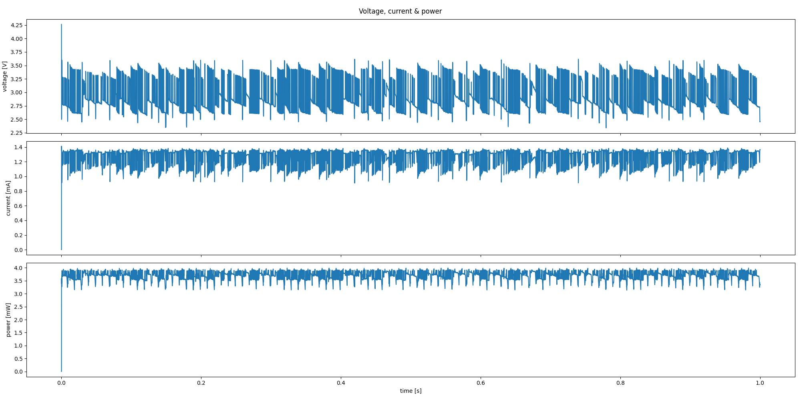

In more detail:

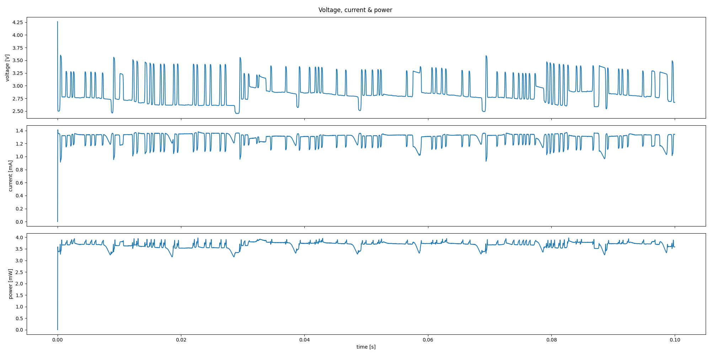

### BQ

BQ-Converters sample the open circuit voltage (VOC) every 16 s for about 256 ms and harvest at a set-point of 0.76 * VOC. First the voltage, then the current shows typical 50 Hz line flicker from the fast LEDs.

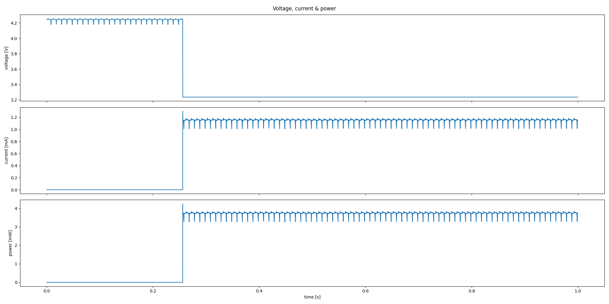

In more detail:

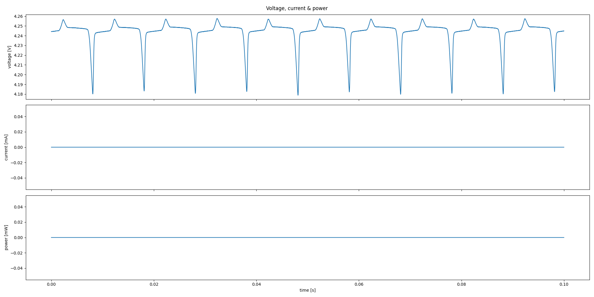

### CV20

Due to the constant voltage the 50 Hz line flicker is only visible in the current-plot.

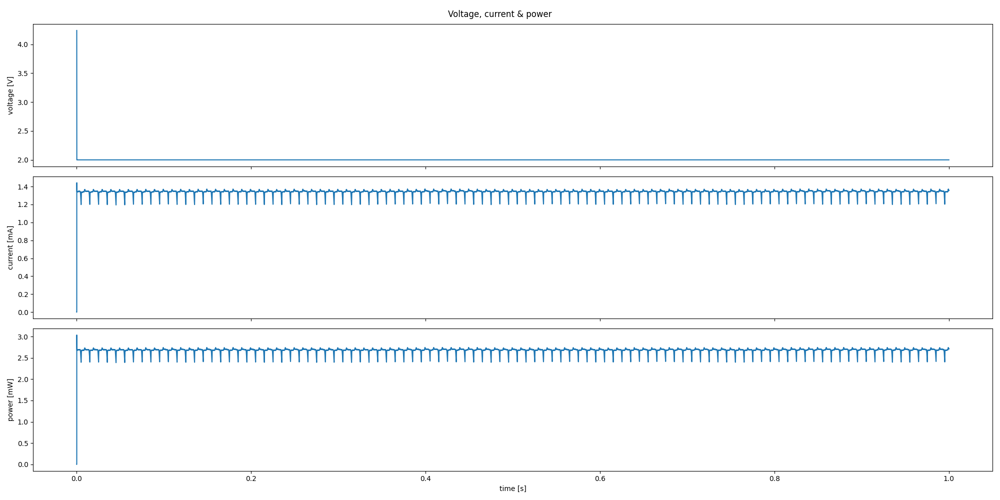

In more detail:

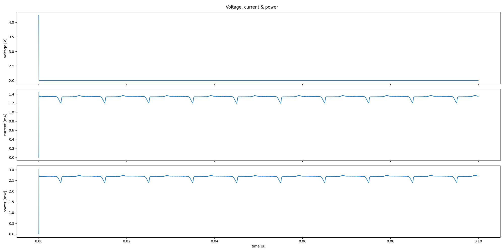

### IVCURVE

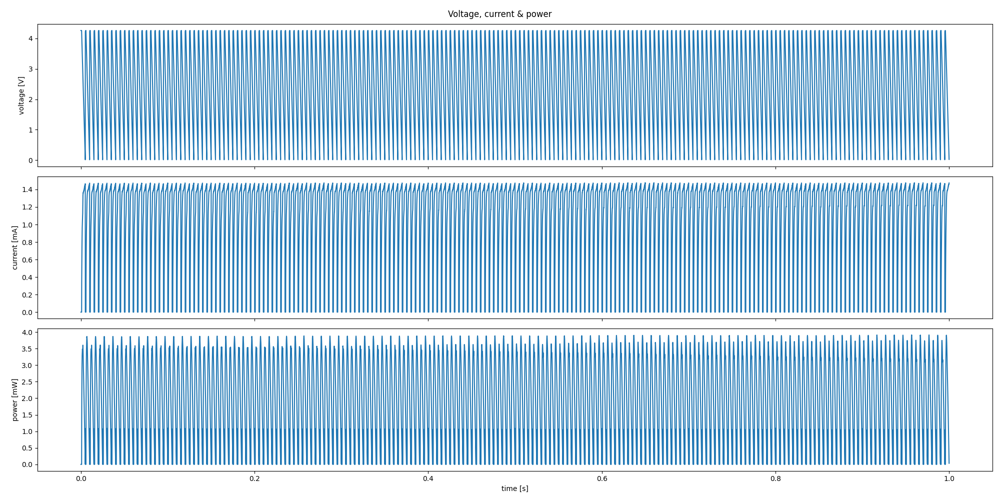

In more detail:

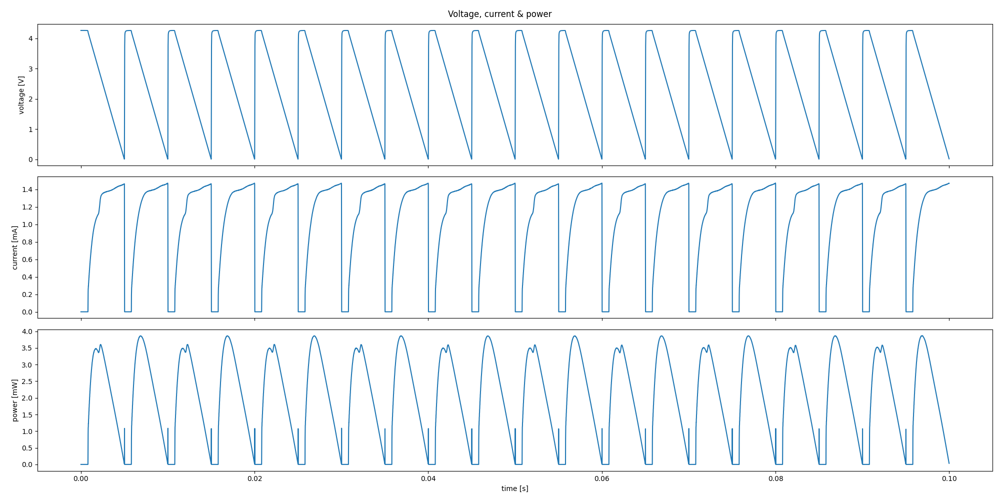

Due to the 50 Hz line flicker every current ramp is uniquely shaped.

### Extra IVCurve-Processing

Using the given [vHarv-Example-code](https://github.com/orgua/shepherd-datalib/blob/main/shepherd_core/examples/vharvester_simulation.py) shows discrepancies when working with IVCurves.

```
E_out = 17.279 mWs -> cv20
E_out = 11.129 mWs -> cv10
E_out = 21.933 mWs -> mppt_voc
E_out = 17.069 mWs -> mppt_bq_solar
E_out = 17.069 mWs -> mppt_bq_thermoelectric
E_out = 38.276 mWs -> mppt_po
E_out = 28.517 mWs -> mppt_opt
```

Comparing that to the harvested energy from the beginning:

- `mppt_opt`: 36.720 mWs
- `mppt_bq`: 35.957 mWs
- `cv20`: 26.371 mWs
- `ivcurve`: 19.718 mWs

Losses of > 50% are visible.

### Extra Emu Comparison:

The `IVCurve`-Discrepancies also shows in an emulation of a BQ25570 with V_out = 3V and a 1 kOhm Resistor as Target. 
 

#### MPPT_Opt into BQ25570

First the emulation is run on a real cape with `mppt_opt` as input where 36.72 mWs go in and 24.99 mWs are used, resulting in a ~50 % duty cycle:


Simulating the target-resistor by using the python-implementation of the vSource will produce almost the exact same graph:

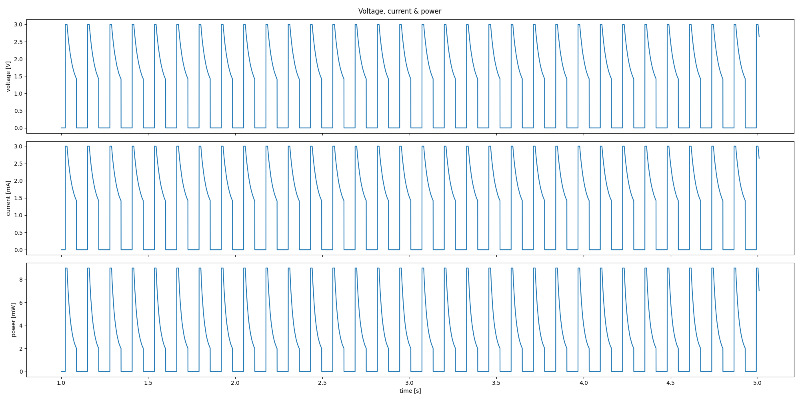

Comparison:

- input = 36.72 mWs
- emu output = 24.99 mWs
- sim output = 24.54 mWs

The simulation is missing the transient spikes from the HIL-emulation.

#### IVCurve into BQ25570

The same setup & config running with `ivcurve`-input, where only 10.54 mWs are used and the duty cycle is much lower and irregular:

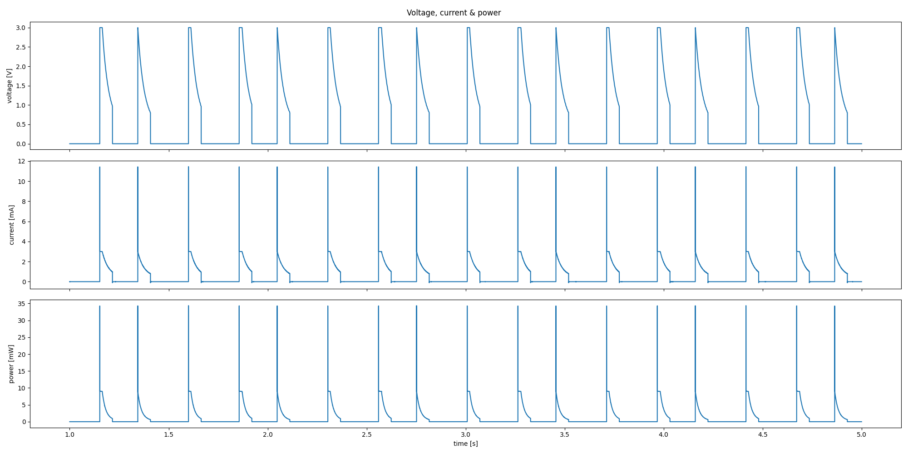

The simulation shows a more regular pattern:

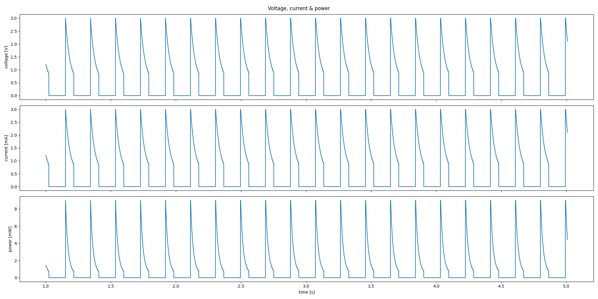

Comparison:

- emu output = 10.54 mWs
- sim output = 10.64 mWs

The simulation shows a higher activation-count (20 vs 17 in 4 s). The HIL-Emulation shows a slightly different behavior that manifest in a larger 3V plateau.
