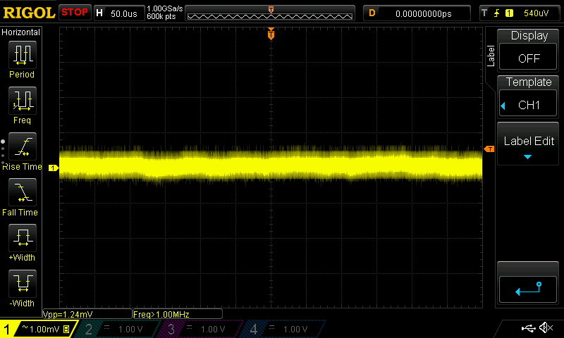

# Cape Noise Performance

## Problem

- Beaglebone offers noisy SYS_5V0 - TODO: add Vpp num
- POE is also noisy - TODO: add Vpp num
- shepherd shows residues of voltage spikes in target voltage
    - Solved: confirmed to be due to a "transmitting" usb-hub 50 cm away from test-setup (not powering anything)

## Setup

- BBGreen with Shepherd-PCB, Output VTarget set to 3V
- scope: rigol ds1104z, 100 MHz, calibrated, compensated probes, up-to-date firmware

- 50 cm radius free of additional metal
- Power-Supplies
    - setup1: 5V to BB via benchsupply with 1mF on input
    - setup2: as setup 1, but shepherd 5V and 3v3 powered by keithley sourcemeter, 1m 4-Port Cables, not buffered by Cap
    - setup3: BB powered by NoName POE-Splitter (EC-PD0520USB)
    - setup4: BB powered by TP-Link POE-Splitter (TL-POE10R), buffered by 1 mF on Input
- Measurement
    - scope input set to AC to analyze ripple, internal 20 MHz low pass active
    - probe set to 1x for low noise
    - probe connected with short ground-loop to closest GND
    - timebases /div (mostly): 50 ms, 10 ms, 1 ms, 100 us, 10 us, 1 us, 100 ns
    - voltage range: lowest setting without clipping, mostly 1 mV/div
    - scope-math: Voltage-peak-peak, frequency
- Scope-Screenshots (DS1Z_Quickprint#.png) are not linked or included here, only referenced for each measurement (./media_noise/)

### Scope Noise with grounded signal-input

## Measurements

- Probe Signal shorted to ground (noise floor)
    - Vpp = 1.20 mV
    - no abnormalities or standing waves
    - QuickPrint 26-31
- **SETUP 2**
- A5V (setup2) - on biggest cap after regulator
    - Vpp = 2.10 mV
    - 1.3 MHz Ripple (1.72mVpp)
    - QuickPrint 32-36
- 10V (setup2) - on biggest cap after regulator
    - Vpp = 3.40 mV
    - 7 kHz Ripple,
    - QuickPrint 37-41
- VTargetA = 3.3 V (setup2), 1k Load
    - Vpp = 1.90 mV
    - no abnormalities or standing waves
    - QuickPrint 42-46
- VTargetA = 3.3 V (setup2), no load
    - Vpp = 1.72 mV
    - no abnormalities or standing waves
    - QuickPrint 47
- VTargetB = 3.0 V (setup2), no load
    - Vpp = 1.65 mV
    - no abnormalities or standing waves
    - QuickPrint 48-52
- SourceMeter 3V3 (setup2), ~ 4.06 mA Shepherd-Load, 4-Port-Meas
    - Vpp = 16.6 mV (unfiltered input)
    - no abnormalities, some switching noise
    - QuickPrint 53-57
- SourceMeter 5V0 (setup2), ~ 73.9 mA Shepherd-Load, 4-Port-Meas
    - Vpp = 20.4 mV (unfiltered input)
    - no abnormalities, some switching noise
    - QuickPrint 63-67
- BBone 3v3 (setup2) - on pinheader, shepherd not connected
    - Vpp = 46 mV
    - no abnormalities, some switching noise 20 kHz & 333 kHz
    - QuickPrint 58-62
- BBone SYS_5V / P9-7/8 (setup2) - on pinheader, shepherd not connected
    - Vpp = 145 mV
    - all kind of fragments from msec to nsec (50 ms & 1us view shows best)
    - QuickPrint 68-72
- BBone VDD_5V / P9-5/6 (setup2) - on pinheader, shepherd not connected
    - Vpp = 5.6 mV
    - minor abnormalities, 5Hz wave, 333 kHz switching fragments
    - QuickPrint 73-79
- **SETUP 1**
- VTargetA = 3.3 V (setup1), no load
    - Vpp = 1.8 mV
    - no abnormalities or standing waves
    - QuickPrint 80-87
- A5V (setup1) - on biggest cap after regulator
    - Vpp = 1.9 mV
    - no abnormalities, some ripple ~1.3 MHz, 1.6 mVpp
    - QuickPrint 101-106
- BBone 3v3 (setup1) - on pinheader
    - Vpp = 51 mV
    - switching noise 20 kHz, 250 kHz
    - QuickPrint 107-113
- BBone SYS_5V / P9-7/8 (setup1) - on pinheader
    - Vpp = 111 mV
    - switching noise 10 Hz, 50 Hz, 20 kHz, 333 kHz, 2.5 MHz
    - QuickPrint 114-120
- Bench Supply 5V (setup1) - 360 mA Load
    - Vpp = 37 mV
    - switching noise 10 Hz, 50 Hz, 2.5 kHz
    - QuickPrint 121-130
- Bench Supply 5V (setup1) - no Load
    - Vpp = 20 mV
    - switching noise 4 kHz
    - QuickPrint 131-137
- **SETUP 3**
- BBone 5V Input (setup3), TP-Link Poe
    - Vpp = 22 mV
    - switching noise 10 Hz, 50 Hz, 16 kHz, 256 kHz
    - QuickPrint 201-207
- VTargetA = 3.3 V (setup3), no load
    - Vpp = 2.7 mV
    - no abnormalities, but some oscillation around ~ 1 MHz
    - QuickPrint 208-215
- A5V (setup1) - on biggest cap after regulator
    - Vpp = 3.3 mV
    - no abnormalities, but some oscillation around 1.3 MHz
    - QuickPrint 216-224
- **SETUP 4**
- BBone 5V VCC P9-5/6 (setup4), NoName Poe
    - Vpp = 7.6 mV
    - heavy switching noise ~ 75 kHz
    - QuickPrint 225-232
- VTargetA = 3.3 V (setup4), no load
    - Vpp = 12.2 mV
    - heavy switching noise ~75 kHz
    - QuickPrint 233-239
- A5V (setup4) - on biggest cap after regulator
    - Vpp = 11 mV
    - ramps with 50 kHz and the additional switching noise
    - QuickPrint 240-246
- **Setup1 - Tuning InAmp**
- VTargetA = 3.3V, 1k Load
    - Vpp = 1.9 mV
    - some oscillations at 145 kHz - 1 MHz
    - QuickPrint 301-307
- TP2
    - Vpp = 1.3 mV
    - not enough detail, but looks like noisefloor
    - QuickPrint 308
- TP5 - InAmp Output
    - Vpp = 110 mV
    - some oscillation just shy of 1 MHz
    - QuickPrint 309-318
- 10V - over biggest Cap
    - Vpp = 3.6 mV
    - some oscillation at 10 kHz
    - QuickPrint 319-324
- -6V - over biggest Cap
    - Vpp = 3.4 mV
    - some oscillation at 1.3 MHz
    - QuickPrint 325-330
- **MOD**: 8.2 OHm right before 1 Ohm Shunt
- TP5 - InAmp Output
    - Vpp = 16.4 mV
    - no abnormalities
    - QuickPrint 331-336
- Over 1 Ohm Shunt
    - Vpp = 2.24 mV
    - no abnormalities
    - QuickPrint 338
- Over 1 Ohm Shunt
    - Vpp = 2.24 mV
    - no abnormalities
    - QuickPrint 338
- **MOD**: 1k on InAmp-Output
- TP5 - InAmp Output
    - Vpp = 12.6 mV
    - no abnormalities
    - QuickPrint 339-344
- **MOD**: 100 nF over InAmp Input
- Over 1 Ohm Shunt
    - Vpp = 2.36 mV
    - oscillations at 380 kHz
    - QuickPrint 345-351
- TP5 - InAmp Output
    - Vpp = 11.5 mV
    - no abnormalities
    - QuickPrint 352-357

## Analysis

- disclaimer
    - some noise is very close to the scopes lower threshold (~ 1.2 mVpp)
    - A5V-LDO should have ~ 18 uV RMS-Noise with 60 dB Ripple Rejection (but show with higher noise)
    - ⇾ measurements can't be trusted when looking at individual values, but comparisons should be valid
    - amplifying active probe should be preferred
- A5V and VTargetA are very similar ⇾ further analysis will take maximum of these two
- setup comparison (worst to best)
    - setup4 (NoName POE) shows heavy artifacts, Noise VTarget = 12 mVpp
    - setup3 (TPLink POE) shows some oscillations, Noise A5V = 3.3 mVpp
    - setup2 (Shepherd powered by sourcemeter) shows minor ripple, noise A5V = 2.1 mVpp
    - setup1 (benchPowered BB) shows minor ripple, Noise A5V = 1.9 mVpp
- Sys_5V-Line is surprisingly noisy, but has limited influence on VTarget
- 10 V / -6 V has some 7 - 20 kHz Ripple ⇾ most likely bad for InAmp

## Conclusion / Mitigations

- BB-Power should be avoided
    - switch to VDD_5V (less noisy) instead of sys-5v ⇾ NOT POSSIBLE
    - Sys-5V was already used in previous shepherd pcb
    - avoid 3v3, generate on shepherd
    - allow manual "switch" to only use external power (move ferrite from sys_5V input to tap into 5v_ext-rail)
- InAmp - further improvement in noise
    - filter input, increase shunt to 10 Ohm, and 100nF parallel to the shunt brings 160 kHz Lowpass
    - filter output, 100k in line to ADC. ADC Pin has Capacitance of 5pF, Line ~1pF, brings ~300 kHz ⇾ option to solder a cap to Testpoint
- POE-Input
    - should be allowed to be > 5V, and filtered by ldo
    - **TP-Link TL-POE10R V5.0** is rated for 1A @ 9/12V, 2A @ 5V ⇾ ~ 10 W
- Side Note
    - TP-Link POE-Splitter has heat-issues at least when powering ~300@5V, ICs are Ok, but the input Cap (47uF 100V) gets also very warm ⇾ may shorten life-expectancy
    - there is no cheap alternative for this unit

## Stabilize Supplies

- Options for Stability / less noise
    - avoid switching regulators (noise usually >> 1 mVpp)
    - use LDO, specially low noise or ultra low noise ones (low noise LDOs are somewhere around 1 mVpp)
    - passive LC-LowPass at the End (
- 6V-Switching-Regulator had big opt-potential, 6x less Vpp-Switching-Noise
- +10/-6V-Regulator for InAmp
    - LT3487 is claiming low noise due to high frequency
    - regulator hysteresis should be around 6-7 mV for both rails (FBP has 7 m%/V, FBN has 1 mV/V Line Regulation)
    - measurements show ~ 3.4 mV after ferrite
- previous shepherd pcb
    - LM27762 has charge pump + ldo for 22 uV_RMS and 43 dB Ripple-Rejection, 1.5 mV/V Line and 34 uV/mA Load Regulation, but only outputs +-5V
- use additional very-low-noise LDOs (+10/-6V)
    - LP2985, 10V LDO, 30 uV_RMS, 45 dB Ripple Rejection
    - MIC5219 2.5 to 12 V LDO, 300 nV / sqrt(Hz), 75 dB Ripple Rejection, 9 m%/V Line Regulation
    - ADP7118, 2.7 to 20 V LDO, 11 uV_RMS, 50 dB Ripple Rejection, 15 m%/V Line Regulation
    - TPS723, -2.7 to -10 V LDO, 60 uV_RMS, 48 dB Ripple Rejection, 40 m%/V Line Regulation
    - Ricoh RP117x, -5.5 to -1 V, 80 dB Rejection, 16 uV_RMS,
    - LT3094, ultra low noise, 0 to -20V, 74 dB Rejection, 2.2 nV/sqrt(HZ), 0.8 uV_RMS
- InAmp AD8421
    - Inputs range from 0 to 5 V,
    - differential Voltage of 0 to 500 mV, Gain 10 ⇾ Power supply should be at least +9 V & -5 V, Ref = GND
    - differential Voltage of 0 to 50 mV, Gain 100 ⇾ Power supply should be at least +9 V & -5 V, Ref = GND
    - Diamond Plot: https://tools.analog.com/en/diamond/#difL=0&difR=0.05&difSl=0&gain=100&l=0&pr=AD8421&r=5&sl=0&tab=1&ty=2&vn=-5&vp=9&vr=0
    - there are two InAmps with a budget of ~ 74 mW, ~ 4.6 mA
- Positive Voltage ⇾ Voltage Doubler
    - LM266x not suited, no low noise
    - LM276x not suited, no low noise
- Negative Voltage ⇾ Inverter, Charge Pump
    - LM27761, 20 uV_RMS, 35 dB rejection, 1.5 mV/V Line and 4.6 uV/mA Load Regulation,
    - LTC1550, not suitable
    - TPS63710

## Verification of PI-Filter with Spectrum Analyzer

- SA
    - Rigol DSA 815 (9 kHz to 1.5 GHz) with tracking generator
    - 1 MHz Span, beginning at DC
- Filter
    - 15 uH shielded coil with 100 uF / 6.3 V on both sides
    - corner frequency: 4.1 kHz
- TG provided 0 dBm and input was calibrated to it
- open-input and filter in line showed no significant difference (no noticeable rise of the noise-floor)
