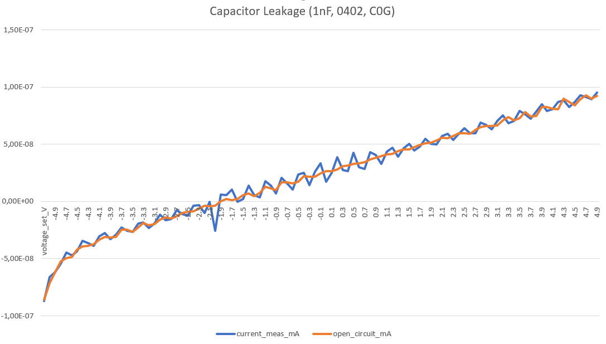
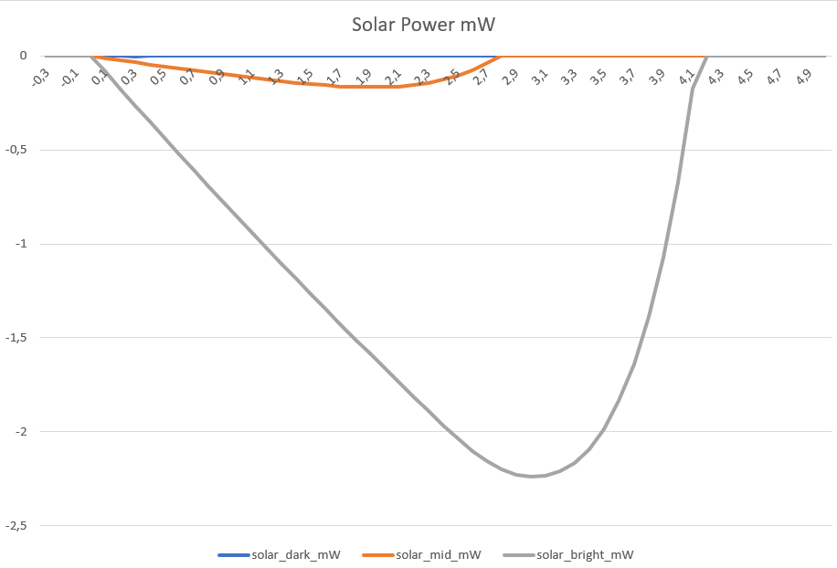
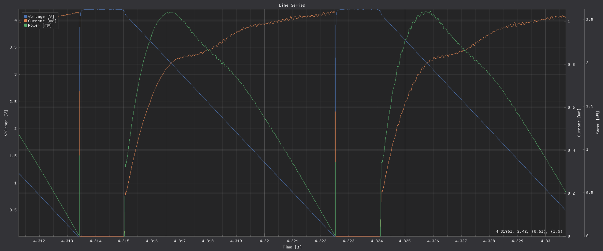

Shepherd Cape v2.3 - Performance
================================

Tested
------

- WD is fine now -> Board gets turned on
- BB boots with Shepard Cape on
- BB-powered boot works, but turning Cape on crashes the 5V Rail (P9-7/8)
- WD restarting BB works

Troubleshooting
---------------

Profiling Ranges

- full range: 0 to 5V, 0 to 50 mA
- limited range: 1 to 3.9 V, 3uA to 40mA

Harvester - low current measurement-limit

- draining below 1-2 uA -> voltage seems to invert (SMU reports -0.3V), not caring about the set-voltage of the DAC
- adc-current values are equal to "zero"
- diode blocks (later tests show 2nA reverse current), because voltage at cathode (opAmp-Out) is similar high to DAC-Voltage
- something seems to reverse leak current -> tldr: it is the OPA189 Negative Input Pin
    - **OPA189 input** can leak max +-1 nA (input bias current) and differential input impedance is 100 MOhm (100nA to 10V)
    - AD8421 inputs can leak max 2x +-500 pA, tests show < 1 nA
    - OPA2388 input can leak max +-400 pA (spec), tests show < 1 nA
    - diode is rated for 40 nA but shows in tests 2 nA @ 5V (see picture below)
    - capacitor C34 (Opa-Feedback) could leak -> tests show < 1 nA @ +-5V-Range (see picture below)
    - and the op189 output -> not relevant due to safe diode and capacitor
    - removing R20 stops the leak -> hint at OPA189 or cap C34
    - removing C34 changes nothing -> final clue for OPA189
- that may never occur with a real harvesting source (or work as a hard-to-detect offset)
- baking pcb off (80 °C, 30min) had no effect (mentioned in datasheet)
- this leakage is often not existent when SMU is freshly started for the day -> firmware-update to 3.4.0 (2021-04, from 3.2.2 2016-04) did not help
    - see profile 25, whole voltage range, down to 0 uA
- changing R20 (Feedback-Lowpass) to 100R or 10k does not change behaviour
- tests with solar-cell (SM101K09L) shows that 2uA is near to dark environment
- old TODO:
    - reverse position of diode and shunt
    - OPA189 speaks of (8.3.3) input bias current clock feedthrough (switching input to correct intrinsic offset)
    - -> it seems to be the "zero-drift" feature of OPA189 that gets triggered wrongly
    - worst outcome: 1-2 uA offset in measurement
- Update: this problem went away by using another py-lib for the SMU (and cleaner, more explicit init)

Schematic of Harvester v2.3

.. image:: ./media_v23/harvester_schematic_v230.png

Current Leakage for Capacitor 1nF (C0G)

Current Leakage for Harvest Port

.. image:: ./media_v23/current_leakage_at_harvest_port.png

Power from Solar Cell (SM101KO9L) in various conditions

Diode Comparison

- PMEG10010ELRX
    - rated for (extremely low leakage current) **4 nA @ 10 V & 25 °C** and 40 nA (typical, 150 nA max) at 100V & 25°C
    - measurement: -5 V result in **2.1 nA at room temperature**
    - seems the safest bet, because datasheet promises the spec
- SMMSD701T1G
    - rated for ~ 8-9 nA @ 6-12 V & 25 °C (curves in datasheet)
    - measurement: -5 V result in **1.4 nA at room temperature**
    - lowest leak-value but not distinguishable from PMEG-Version in Frontend
- RB168MM-40TR
    - rated for 50 (typical) to 550 uA reverse current @ 40 V
    - curves in datasheet show IR @ 5 V, 25°C at around 10 nA, up to 1000 nA at 75°C
    - measurement: -5 V result in **6.9 nA at room temperature**
- the first two diodes are fine!
- --> see media_v23/profiler_smu_diodes.csv

Reverse Current of Diodes

.. image:: ./media_v23/diode_reverse_currents_smu-measured.png

Harvester - Current Measurement

- 2R-Shunt, Gain x48 -> 10R Shunt, Gain x10
    - no significant effect from profiler
    - **keep synced to emulator to save parts**
    - **keep 2R-Shunt**
- Lowpass between InAmp and ADC
    - 100k results in high offset of > offset of 11'800 n for 0 nA (ADC input seems to be raised by ADC itself)
    - 1k results in offset = ~ 182 n (Good) and lower Noise, mostly on full range (3-14x better)
    - 100R seems to worsen limited area (slightly), but improve full range (almost x2)
    - Cap was varied to match 80 - 160 kHz lowpass, but influence is minimal
    - 0R caused trouble with voltage dependend current reading +-10uA from 0 to 5V
    - **33R / 10nF** is fine, limited range gets minimal worse, but full range improves
- buffered shunt (parallel cap C35)
    - 470 nF instead of nothing: 10 - 20% improvement on limited and full range
    - nothing instead of 100 nF: 5-10 % worse on full range, minimal better on limited range (but with 100 nF seems the better bet)
    - 100nF instead of nothing: ~10% improvement on both ranges
    - **later tuning showed almost no influence of the cap (0, 10, 100nF) only max_error gets limited in profiler**
    - **10nF does suffice!**
- buffered inputs (Caps on V_HRV and V_Sense)
    - adding 2x 100nF is ~ 10 % worse
    - **remove**
- different diode (try alternatives)
    - no significant effect between new (and better) SMMSD701T1G-Diode and (current) PMEG10010ELRX
- slower OpAmp-Feedback
    - R20, 10k instead of 1k or 100R: 10-12% improvement for both ranges, but only static case (lowpass 16 kHz)
    - later tuning showed that 100R (compared to 330, 1k) are preferred, because OpAmp has to be fast (for the nonlinearitiy, ie. in voltage sweeps
    - **faste OpAMp** is better, as long as stable
- DAC to OpAmp Connection
    - slower response helps measurement
    - current 1k & 1nF are fine -> 9 us risetime from rail to rail (same with 200R, 1nF)
    - 100R & 10nF seem to perform a bit better
- shield
    - is not hurting the measurement, but helps with noisy environments
- set DAC-Ref-voltage to external A5V
    - current-reading improvement, while voltage worsened? but error stayed after reversing the change
    - TODO: investigate

Harvester - Voltage Measurement

- bigger shunt Resistor is 5-10% worse
- C35 parallel to shunt is better than no Cap, 100 nF is fine, 10nF also
- R16 before ADC-V is better smaller, but filtering is also
- Cap before ADC-V is better, 10nF compared to nothing brings 10 % improvement
- R18 before OpAmp was 1k, removal brings 10 % improvement
- Caps 100nF on Pinheader-Inputs is 5-10 % worsening
- R20 low -> Voltage-Matcher should be rather fast (better for V_meas, worse for C_meas)
- DAC-Lowpass is fine, lower Freq helps measurement

Without ShuntBuffer the current reading may be noisy (1k OpAmp Feedback, 0nF Shunt-Buffer)

.. image:: ./media_v23/hrv_iv110Hz_Shuntbuff_C35_0nF_FB_R20_1k.png

Improvement with 10nF ShuntBuffer

.. image:: ./media_v23/hrv_iv110Hz_Shuntbuff_C35_10nF_FB_R20_1k.png

OpAmp is stable enough to lower FB to 100R -> this gets rid of the nonlinearity in the sweep (area where open circuit voltage meets voltage ramp):

.. image:: ./media_v23/hrv_iv110Hz_Shuntbuff_C35_10nF_FB_R20_100R.png

Emulator

- can't produce 5 V with 50 mA
- even at 0 mA the limit of 5 V is not completely on point,
- at 50 mA around 4 V are usable without large error
- -> seems to be fine for modern electronics
- 2 R Shunt resistor is responsible of 100 mV drop (50 mA)
- R10 from 100k changed to 0R -> offset still around 15.x, similar as with 33R in harvester
- 5V-Voltage regulator needs at least +1V Input -> raise 6v_Rail from 5.4V to 6.17V -> Emulator improves to 50mA @ ~4.28V
- Opa388 seems to be worse than the Opa189 -> switch to this one

.. image:: ./media_v23/profile_quiver_offset_sheep0_cape_v230c1_profile_07_short_C6_increased_1uF_emu_a.png

BB-Powered Mode

- turning cape on when on BB-USB-Power crashes the system
- 5V_BB (P9-7/8) gets connected to 5V Line with inductor and large 1mF Cap
- most inductors show only minimal influence -> remove them
- more capacity on power-line is better (A5V is most significant), see traces below

No additional Buffering on A5V-Line

1mF Cap on A5V line - less noise!

.. image:: ./media_v23/hrv_iv110Hz_A5V_1mF.png

Stabilize ADC-Readings (work through datasheet for more design guideline hints)

- ADC ADS8691
    - use X7R caps for V_in and ref-pins
    - low impedance sense-input
- InAmp AD8421
    - VS with 100nF + 10uF
    - RG with minimized capacitance
    - connection to ADC: 100R + 3nF
    - ref-voltage with OP1177, with 5k feedback, no C, 10 uF buffer for OpAmp Input
    - low impedance connections, input can be buffered
- OpAmp Opa189
    - same as Opa388
    - seems more stable than opa388, fb-cap can be omitted
- OpAmp Opa388
    - shield / isolate from air-currents and heat-sources
    - place 100nF directly to pwr-in and use groundplane
- DAC8562
    - AVdd with 100pF, 1nF, 100nF, 1uF
    - VRef-Buffer, higher capacitance raises noise floor?
    - internal reference is more noisy (1.4 to 3x less noise with perfect external ref) -> fail because voltage has huge error (current got more stable though)
- LDO LP2989
    - bypass cap 10nF C0G or NP0
    - provide VIn >= VOut + 1V
- Inverter LT3487
    - Thermal Pad (GND) low impedance, many vias
    - bypass with X7R
    - negative channel >= 10uF, pos Channel > 4.7 uF
    - phase lead caps for dampened load response (10-33pF parallel to FB-Res)
    - input can start at 1uF

Further noise-reducing Experiments:
- ADC: R10 33R, C62 10nF lowpass, 482kHz -> not much difference?
- R8, 5k OpAmp FB from 2k ->
    - 50 mV from std-dev 2800-4000-26, to 25-52-25
    - 2V from 31-60-31 to 25-56-30
- C3, 1nF OpAmp FB remove
    - 50mV completely unstable
- C5, remove 1uF DAC_Ref-Buffer
- DAC_Ref to A5V -> 1.4 to 3x less noise expected
    - 2V to std 22-55-29
    - current-channel is improving a bit overall (>5%), but with 20% larger max-errors
    - voltage-channel is 25-100% worse (mean)
- HRV
    - R20 back to 1k
    - R22 to 33 R, C140 to 10nF
    - R27 to 33 R, C36 to 10nF
    - R27 back to 100 -> 100R & 10 nF -> 160 kHz
    - R27 1k, C36 1nF -> same 160 kHz
    - C35 Buff, 0nF,  10nF, 100nF
    - R20 FB smaller 1k, 330R, 100R, 33R
        - 100R - 50 us for 0 to 5V, significantly smaller bump between ramp and open voltage
        - openC still 50us, even with reduced R27/200R -> Scope shows 9us risetime at diode (200R)
        - 1k (R27, back to normal) still 9us risetime on scope
- cross-supply DAC
- emu
    - DAC-out 33R, 10nF

Level-Translators

- speed for programming should exceed 1 MHz
- test shows safe flanks for ~ 200 kHz
- setup
    - Level translator: 74LVC2T45GS
    - Analog Switch: NLAS4684
- Risetimes for different configurations:
    - 1k + NLAS -> 1000 ns -> 434 pF tracecapacity calculated
    - 330R + NLAS -> 340 ns -> trace-capacity unchanged
    - 1k + removed 100k PU -> 1000 ns -> trace-capacity unchanged
    - 1k + removed NLAS -> **37 ns** -> 16 pF capacity, Trace ~20mm, w=0.2mm
    - 1k + removed NLAS + trace to PinHeader -> **45 ns** -> 19.5 pF (~40 mm Trace, w=0.2mm)
- capacitance
    - scope probe = 13 pF
    - Line-Capacitance = 1 pF / 7mm
    - NLAS-Capacitance = 414 pF -> both outputs behave a bit different ~ 10 % off
    - C_off = 104 pF (typical), NLAS-Datasheet @ 1 MHz
    - C_on = 330 pF (typical), NLAS-Datasheet @ 1 MHz
- Pin-Capacitance of uC, and drive capabilities
    - nRF52  3-4 pF, gpio current is 14/15 mA
    - msp430 5pF, gpio current is 6 mA
    - AM335x 5.5 pF, gpio current is 8 mA
- **constraints for the next analog switch**
    - VIn >= 5V
    - capacitance << 100 pF
    - leakage << 100 nA
    - https://www.mouser.de/c/semiconductors/switch-ics/analog-switch-ics/?mounting%20style=SMD%2FSMT&number%20of%20channels=2%20Channel~~7%20Channel&instock=y&rp=semiconductors%2Fswitch-ics%2Fanalog-switch-ics%7C~Number%20of%20Channels&sort=pricing
    - https://www.mouser.de/c/semiconductors/switch-ics/analog-switch-ics/?configuration=1%20x%203PDT~~1%20x%204PDT%7C~1%20x%20DPDT%7C~2%20x%20DPDT~~2%20x%20DPST%7C~2%20x%20SP4T~~2%20x%20SPDT%7C~3%20x%20DPDT~~3%20x%20SPDT%7C~4%20x%20SPDT%7C~6%20x%20DPDT~~8%20x%20SPDT&mounting%20style=SMD%2FSMT&instock=y&sort=pricing&rp=semiconductors%2Fswitch-ics%2Fanalog-switch-ics%7C~Configuration

Vc = Vs * (1 - e^(-t/(R*C)));
C = t * log(e)/(R*log(Vs/(Vs-Vc)));
tau = R*C;
fc = 1/(2*pi*R*C);

Close Contestants for SPDT (or DPST, naming is not precise)

- NLAS4684, 5.5V In, ~330 pF, 1-2 nA Leakage
- FSA2258, 4.3V In (max 5.5V), ~ 50pF, 10 nA Leak -> using 5V is too risky
- DIO3712, 6V In, ~ 10pF, max 2 uA Leak -> typical leakage unknown, too risky
- PI5A4158, 5.5V In, ~ 34pF, 40 nA Leak -> strange package 1x3mm
- DIO1269, 5.5V In, ~ 120 pF, 20nA Leak
- DG2735A, 6V In, ~ 120pF, 10 nA Leak,
- NLAS3158, 5.5V In, 19 pF, 100nA Leak,
- DGQ2788, 6V in, 26pF, 1.2uA Leak,
- FSA2275, 6V in, ~ 25pA, 1uA Leak

Implemented Changes after V2.3
-----------------------

- 74LVC2T45GS has too small pads -> prone to errors (very hard to see, but shorts under IC in all cases)
- drc-rule: Force proper Fanout with Neck-Down (<=100%) -> EC seems to extend solder mask expansion on its own
- drc-rule: increase solder mask sliver (Gap) >= 0.2 mm
- drc_rule: solder mask expansion default 0.04mm (was .06) -> with manual override for fine-pitch footprints (min. 0.005 for 0.35mm-Pitch)
- drc-rule: silk from pad distance >= 0.08 mm
- paste mask pad fill ~ 66 - 80 % (30% reduction), thermal pads ~ 50-60% (45% reduction) for 100um Stencil
- paste mask minimum dimensions 0.26 * 0.30 mm (T3 Paste with 25-45 um Balls), only exception: 0.35mm-Pitch part and small BGA with round d=0.25 Cutout
- move ~1/3 of paste to not under IC
- silk more symmetrical, cleaner and helpful
- rework footprint-lib accordingly
- feducials can go, are on outer frame
- reverse order of diode & shunt in harvester ?? No, seems fine currently
- rotate harvest port in schematic to reflect board layout
- add usb-c to pcb and ditch BB-pwered mode?
- emulator FB-Resistor-Switch can be removed
- ADC RVS-Pin not needed, remove TPs
- revisit datasheets for lower noise suggestions
- A5V needs 1mF, +10V gets 1x more 47 uF, -6V gets 100 uF
- remove coils for 6V, 5V, 10V, -6V
- bring sense- / FB-line directly to target-por -> NetTie
- testpoints don't need gnd - its all around
- hrv-sense directly at pin, netsplit, also FB-lead
- EMU, replace opa388 with opa189 for main-line
- raise 6V to 6.2V (from 5.4), 578k + 100 k (or 680k)
- Pin1 on Headers not clear -> direction 1 2 ... put mark directly under pin1, in direction of pin1&2
- 74LVC2T45GS
    - dir is referenced to VCCA -> switch side with GND
    - QFN-Pinout is wrong! https://4donline.ihs.com/images/VipMasterIC/IC/NEXP/NEXP-S-A0002881467/NEXP-S-A0002881253-1.pdf?hkey=6D3A4C79FDBF58556ACFDE234799DDF0
- harvester
    - ADC-IN: R22 low but not 0, C140 to 1 - *10nF, R16 & TP6 same
    - DAC-OUT: R27 to 33R - 100R, C36 to 1 - *10nF
    - Drain: R20 lower -> faster response to nonlinearity (diode-voltage from PU to PD)
    - VSense: remove R18 1k
    - ShuntBuffer C35 can be 10 - 100nF
    - update to latest profilings
- 5V to BB before the Inductor? Yes
- 1uF should be X7R (not X5R), check others
- 1mF to 6V and A5V
- Sense-Resistors with lower PPM/K - Value, higher precision
- emu
    - OpAmp FB 2k/1nF is 20% better than 1k/1nF (current, smu), 5k also improves on that (+10%), but might be too slow
    - ADCIn-LPF 33R, 10nF is a good compromise, 4% better tan 100R
    - Shunt-Buffer 10 nF is 10-20 % worse than 100nF unlimited but similar in limited space, 570nF is 3-5x worse than both
- External LED-Button-Connector S4B-ZR-SM4A-TF -> Top Entry type: B4B-ZR-SM4-TF
- order new parts:
    - usb-connector, 2x 5.1k R,
    - more Opa189
    - HRV 3x 10nF, 2x 33R, 1x 1nF
    - 100R (1HRV
    - EMU 1x 33R, 3x 10nF,
    - 1x 680k (6V)
    - 39x 1uF X7R
    - 1x 100R 1% 100PPM
    - 50x 100nF 25 V
- [ADC can use 2x more 10uF on ref-pins] -> NO, skip this one, had min to no effect
- add >16 V Cap to BOM, or 2x ~10V -> wurth, see orderlist -> lifetime,
- new 100nF to +10 - 6V directly, 2x
- more pads for Caps on backside
- big 0402 caps near device -> dont bother with 100nF or smaller -> NO, skip this one, ESR / impedance is better on smaller values (same package)
- change 0402 footprint, bring pads closer together

Changes in Layout
-----------------

- ref-input for InAmp AD8421 (voltage divider + op1177)
- emu, use free opa388 for reference voltage offset, 5mV (60uV input offset * 50 + 400uV output offset) -> 33R || 10k + Cap
- try V-FB without C -> same for Emu-OpAmp, tune emulator similar to harvester
- 10uF should be X7R, but X5R has now 16V, X7R will be <6V? (ADC-Bypass)
- 10nF <should be NP0, but this seems expensive
- level-translators need to reach 1MHz, 1kOhm is limiting to ~200kHz, 2x 400 Ohm is more fitting
- remove 10R by just using 33R?
- correct op-fb,
- new components:
    - level switches

TODO: extend profiling-code to be independent from hardware-cal on cape
