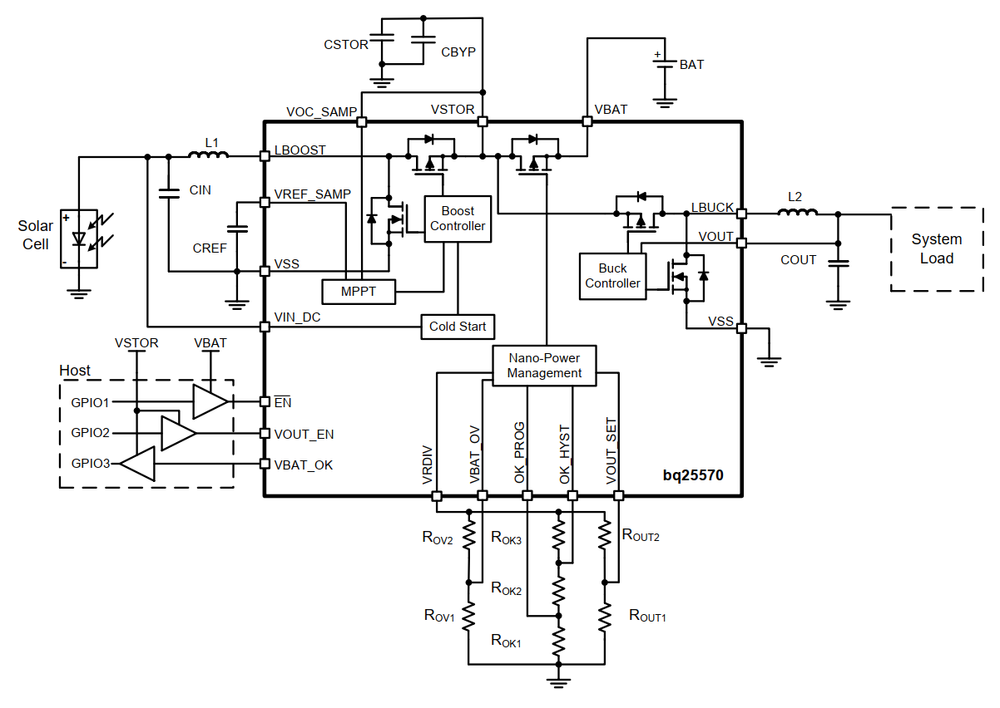

# BQ25570 Characteristics

## Setup

Components discribed from front to back

- constant current (CC) supply
	- 400 mA, 700 mA, 900 mA, 1100 mA 
- LED in wooden light box
	- Cree XM-L
- Solar cells in same box, exposed to the LEDs
	- two KXOB121K04F in series
- BQ25570 with said solar cells as input
	- BQ25570 Eval Kit
- resistive load on output of buck-converter
	- Open Circuit (OC), 1k, 100 ohm
	
## Measurements

- ivcurves of solar cells, recorded with shepherd harvester
- Saleae Logic Pro 16 (2MOhm Impedance) was used to record analog pins of BQ-IC
	- V_IN - output of solar cell, input of BQ
	- V_BAT - voltage over storage capacity on Eval Kit
	- V_Out - output of buck-converter, input of load
- BAT_OK signal was recorded digitally by the logic pro
	- signal is analog according to datasheet. (=V_BAT when ON) 

NOTE: the .sal-files can be opened by the freely available Logic 2 software.
	-> traces can be exported to csv via file -> export raw data

## Analog Parts

R100 = 99.79 Ohm,

R1k = 983.263 Ohm,

C_Stor = 79uF,

## Experiments

- 400 mA LED, open circuit
	- input is disconnected and rises to VOC @ 3.35 V
	- capacitor is limited to ~ 4.1 V max
	- output is stable at 1.8 V
- 400 mA LED, 1k Ohm
	- open circuit voltage seems to be 2.9 V
	- output gets enabled when cap rises above 2.35 V
	- output is on for ~ 10 ms, every 120 ms
	- output does not turn off completely right away
	- bat-OK is never high
- 700 mA, 1k Ohm
	- output is on for ~ 80 ms, every 175 ms (45%)
	- bat-ok is high for ~ 58 ms
- 900 mA, 1k Ohm
	- output is on for ~ 150 ms, every 233 ms (64%)
	- bat-OK is high for ~ 58 ms
- 1100 mA, 1k Ohm
	- output always on
	- cap survives VOC-measurement
- 400 mA, 100 Ohm, intermittent
	- 43 s -> disconnect resistor
	- 58 s -> reconnect resistor

NOTE: all measurements are started with a disabled LED to show startup-behavior of the IC.

## Flaws of the setup

### Solar Cell VOC is too high

Looking at "R1k, LED 1100mA.sal" 

we look at the VOC-Measurement:

The sudden spike of V_IN to 3.93 V is the beginning of the VOC-measurement (233 ms duration). The boost-converter is disabled, V_IN is shortly on a plateau, but soon begins to fall, due to V_BAT falling. Looking closer at these two:

- V_IN begins to fall when V_BAT is ~ 300 mV below V_IN
- V_IN falls from 3.93 to 3.22 V (at the end of the 233 ms time-frame)
- V_BAT falls from 3.65 to 2.75 V during that period
- the voltage difference between V_IN & V_BAT grows from ~ 300 mV to 500 mV
- the BQ takes its VOC-measurement at the end of the 233 ms window and therefor jumps to 80% of 3.22 V = 2.57 V
  - NOTE: the proper MPPT is ~ 3.0 V (76 % of 3.93 V)
- the MPPT-voltage can only be held for a short period of time until the capacitor on V_BAT is full

Looking at the BQ-Schematic: 

The path from V_IN to V_BAT has an inductor and two mosfets. 
The 2nd mosfet between V_Stor and V_Bat might be enabled, but the 1st (left) is disabled with a conducting diode in direction of V_BAT.
While the voltage on the input drops, the current from the solar cell rises and therefor the voltage drop over the diode increases.

### V_Bat over-voltage protection is too low

The same trace from above can also be interpreted differently. 
The chosen solar cell would be fine if the maximum V_BAT would be higher.
V_BAT is limited to < 4.2 V on the eval-board to protect a potential LiOn-battery.

As a direct result of the low over-voltage-limit the set-point is too close to the V_Bat under-voltage-protection-limit.
Trace "R1k, LED 700mA.sal" shows that the VOC-measurement has to be interrupted due to V_BAT falling below 2.0 V:

Another side effect of the under-voltage-protection is that V_OUT of 1.8 V can't be maintained. 
Every drop below V_BAT < 2.0 V shows a drop in V_OUT, even before the output is completely disconnected.
When disconnected the trace shows the discharge of the 22 uF placed on the output.

Typical boost-designs need a certain ratio between V_IN and V_STOR due to duty cycle limitations. 
From the perspective of the boost converter a higher V_BAT / STOR would therefor be beneficial.

### V_Out enabled by V_Stor

This setup enables the buck-converter far too early and long. 
V_BAT moves between 2.8 V and 1.9 V (under voltage protection).
The usable charge of the capacitor is far from good.

NOTE: having the capacity on V_STOR would be making the setup less complex. 
The datasheet of the BQ-IC recommends 100 uF on V_BAT. 
A solution could be to directly link V_STOR & V_BAT (shorten the mosfet) 

## Optimizing the Setup

- lowering the VOC of the solar cell -> one cell, not two in series
- adjust the V_Bat over-voltage limit to ~ 5.25 V (5.5 is the theoretical max)
  - the capacitor is rated for 6.3 V
  - VBAT_OV = 3/2 * VBIAS * (1 + R1/R2), VBIAS = 1.21 V
  - 4.18 V setup: R1 = 7.5 M, R2 = 5.76 M -> EVM-Default
  - 5.00 V setup: change R1 = 10 M -> violates BQ-Req that R1 + R2 < 13 M
  - 5.22 V setup: change R2 = 4 M (2x 2M soldered like V?)
- adjust hysteresis of Bat_OK to 4 to 4.5 V
  - default: 2.79 V to 2.99 V for BAT_OK = ON
  - BATOK-PROG = VBIAS * (1 + R7 / R8)
  - BATOK-HYST = VBIAS * (1 + (R6 + R7)/R8)
  - default: R6 = .887 M, R7 = 6.98 M, R8 = 5.36 M
  - 4.03 to 4.38: change R8 = 3 M
  - 4.03 to 4.43: change R6 = 1 M, R8 = 3 M (preferred)
- enable output with BAT_OK (enable JP6)
- if possible: directly connect V_STOR = V_BAT (shorten the mosfet)
- voltages to measure (31 kHz sampling rate)
  - V_IN
  - V_STOR
  - V_BAT
  - V_OUT
- Setpoint: on-off-behavior should be present
  - double solar cell @ LED900mA can produce 4mW, so one cell should bring 2 mW
  - 1 kOHms at 1.8 V draw 3.2 mW (most interesting)
  - 100 Ohms at 1.8 V draw 32.4 mW
